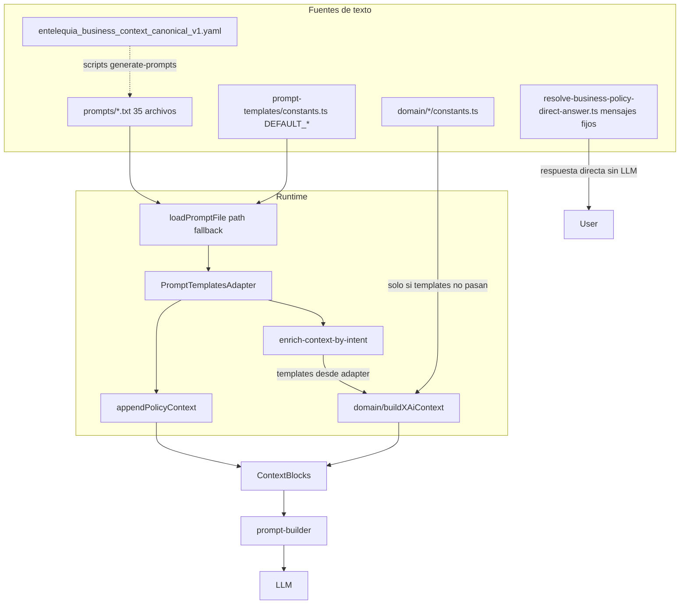

# Plan: Flujo de prompts, constantes y reglas – auditoría y simplificación

## Flujo actual (qué llega al LLM)

**Resumen del flujo:**

1. **PromptTemplatesAdapter** (constructor): para cada “slot” (productos, orders, payment-shipping, tickets, store-info, recommendations, general, static, critical*policy, policy_facts) llama a `loadPromptFile(ruta, DEFAULT*\_)`. Si el `.txt`existe, se usa su contenido; si no, se usa el`DEFAULT\_\_` de [prompt-templates/constants.ts](src/modules/wf1/infrastructure/adapters/prompt-templates/constants.ts).
2. **Enrich-context-by-intent**: según el intent, obtiene esos textos del adapter (`getPaymentShippingPaymentContext()`, `getStoreInfoHoursContext()`, etc.) y los pasa como `templates` a las funciones de dominio `buildPaymentShippingAiContext(templates)`, `buildStoreInfoAiContext(templates)`, etc.
3. **Dominio (format.ts)**: recibe `templates` del adapter. En `resolveTemplates(partial)` usa `partial?.paymentContext ?? DEFAULT_PAYMENT_CONTEXT`: como el adapter **siempre** devuelve todo, en la práctica **nunca** se usan los `DEFAULT_*` de [payment-shipping-context/constants.ts](src/modules/wf1/domain/payment-shipping-context/constants.ts), [store-info-context/constants.ts](src/modules/wf1/domain/store-info-context/constants.ts), etc. para el flujo principal. Solo se usan cosas como `DEFAULT_PAYMENT_METHODS` (fallback para listas) y `DEFAULT_API_FALLBACK_NOTE`.
4. **appendPolicyContext** ([resolve-response-context.ts](src/modules/wf1/application/use-cases/handle-incoming-message/orchestration/resolve-response-context.ts)): añade tres bloques más, todos desde el adapter:

- `getStaticContext()` (archivo static o DEFAULT_STATIC_CONTEXT)
- `getPolicyFactsShortContext()` (derivado: extrae líneas de static + critical_policy + payment general; si no encuentra nada, usa DEFAULT_POLICY_FACTS_SHORT_CONTEXT)
- `getCriticalPolicyContext()` (archivo critical_policy o DEFAULT_CRITICAL_POLICY_CONTEXT)

1. **resolve-business-policy-direct-answer**: respuestas cortas fijas (horarios, devoluciones, reservas, etc.) que **no** pasan por el LLM; son strings hardcodeados que repiten la misma información que está en static, critical_policy y tickets.

---

## Dónde nos pisamos: tres (o cuatro) copias de lo mismo

| Concepto                        | Capa 1 (archivo)                                                                                                                                                                                  | Capa 2 (fallback adapter)                                                                                                                                          | Capa 3 (dominio)                                                                                                                                          | Capa 4 (direct-answer / otro)                                                                                                                                                              |
| ------------------------------- | ------------------------------------------------------------------------------------------------------------------------------------------------------------------------------------------------- | ------------------------------------------------------------------------------------------------------------------------------------------------------------------ | --------------------------------------------------------------------------------------------------------------------------------------------------------- | ------------------------------------------------------------------------------------------------------------------------------------------------------------------------------------------ |
| Horarios locales                | [entelequia_static_context_v1.txt](prompts/static/entelequia_static_context_v1.txt) + [store_info_hours](prompts/store-info/entelequia_store_info_hours_context_v1.txt)                           | DEFAULT_STATIC_CONTEXT, DEFAULT_STORE_INFO_HOURS_CONTEXT en [prompt-templates/constants.ts](src/modules/wf1/infrastructure/adapters/prompt-templates/constants.ts) | [store-info-context/constants.ts](src/modules/wf1/domain/store-info-context/constants.ts) DEFAULT_STORE_INFO_HOURS_CONTEXT                                | [resolve-business-policy-direct-answer.ts](src/modules/wf1/application/use-cases/handle-incoming-message/flows/policy/resolve-business-policy-direct-answer.ts) STORE_HOURS_POLICY_MESSAGE |
| Medios de pago / costos envío   | [payment*shipping*.txt](prompts/payment-shipping/)                                                                                                                                                | DEFAULT*PAYMENT_SHIPPING* en prompt-templates/constants                                                                                                            | [payment-shipping-context/constants.ts](src/modules/wf1/domain/payment-shipping-context/constants.ts) DEFAULT_PAYMENT_CONTEXT, DEFAULT_COST_CONTEXT, etc. | -                                                                                                                                                                                          |
| Devoluciones / política 30 días | [entelequia_critical_policy_context_v1.txt](prompts/static/entelequia_critical_policy_context_v1.txt), [tickets_returns_policy](prompts/tickets/entelequia_tickets_returns_policy_context_v1.txt) | DEFAULT*CRITICAL_POLICY_CONTEXT, DEFAULT_TICKETS_RETURNS*                                                                                                          | [tickets-context/constants.ts](src/modules/wf1/domain/tickets-context/constants.ts) DEFAULT_TICKETS_RETURNS_POLICY                                        | RETURNS_POLICY_MESSAGE en resolve-business-policy-direct-answer                                                                                                                            |
| Reservas 48h / 30%              | En static + critical                                                                                                                                                                              | DEFAULT_POLICY_FACTS_SHORT_CONTEXT, extracción en buildPolicyFactsShortContext                                                                                     | -                                                                                                                                                         | RESERVATIONS_POLICY_MESSAGE en direct-answer                                                                                                                                               |
| Contacto (WhatsApp, email)      | static_context, tickets, escalation responses                                                                                                                                                     | DEFAULT*STATIC_CONTEXT, DEFAULT* en prompt-templates                                                                                                               | -                                                                                                                                                         | orders-escalation-response.ts, direct-answer                                                                                                                                               |

Además existe [entelequia_business_context_canonical_v1.yaml](prompts/static/entelequia_business_context_canonical_v1.yaml) y los scripts `generate-prompts-from-context-entelequia.ts` / `validate-generated-business-prompts.ts`: una **cuarta** fuente de verdad pensada para generar o validar prompts, pero no es la que usa el adapter en runtime (el adapter lee los `.txt` y los DEFAULT del adapter).

---

## Hallazgos adicionales (segunda ronda de investigación)

### Más capas con la misma información

- **Fallback por intent** ([fallback-builder.ts](src/modules/wf1/infrastructure/adapters/openai/fallback-builder.ts)): mensajes fijos por intent cuando el LLM falla o no responde (ej. "Te ayudo con informacion de locales, horarios y como llegar." para store_info, "Te comparto la guia de pagos y envios...", "Siento el inconveniente. Contame el problema..."). Otra copia de “qué hace el bot” que puede desincronizarse de los prompts.
- **System prompts duplicados**: El asistente usa [entelequia_assistant_system_prompt_v1.txt](prompts/system/entelequia_assistant_system_prompt_v1.txt) con fallback en [openai/constants.ts](src/modules/wf1/infrastructure/adapters/openai/constants.ts) `DEFAULT_SYSTEM_PROMPT`. El clasificador de intenciones usa [entelequia_intent_system_prompt_v1.txt](prompts/system/entelequia_intent_system_prompt_v1.txt) con fallback en [intent-extractor/constants.ts](src/modules/wf1/infrastructure/adapters/intent-extractor/constants.ts) `DEFAULT_SYSTEM_PROMPT`. Reglas de negocio (horarios, devoluciones, store_info vs tickets) aparecen también en el intent prompt (“Usa store_info para ubicacion, horarios…”).
- **Products additionalInfo hardcodeado** ([products-context/format.ts](src/modules/wf1/domain/products-context/format.ts) líneas 54-56): fallback cuando no hay templates con "Locales: Uruguay 341 (Centro) y Juramento 2584 (Belgrano)", "Retiro sin cargo en tienda", "Envios a todo el pais". Misma información que static y payment-shipping.
- **Tickets format** ([tickets-context/format.ts](src/modules/wf1/domain/tickets-context/format.ts) línea 28): string fijo "Te comparto primero la politica de devoluciones y cambios para resolver esto rapido." dentro de la lógica de dominio.
- **context_entelequia.txt** (raíz del repo): no lo carga el backend en runtime; es una base de conocimiento de referencia. Hoy hay que mantenerla a mano alineada con prompts/static y canonical; si no, las auditorías (como la de constants vs context) siguen encontrando diferencias.

### Documentación y tests con datos desactualizados o contradictorios

- [docs/radriografia_nodo.md](docs/radriografia_nodo.md) línea 62: "Horarios: L a V 10-19hs, Sábados **11-18hs**" (incorrecto; debería ser 10-17).
- [docs/CAPACIDADES_Y_ACCIONES_CHATBOT_ENTELEQUIA.md](docs/CAPACIDADES_Y_ACCIONES_CHATBOT_ENTELEQUIA.md) línea 236: checklist "sábados **11–18**" (incorrecto; debería ser 10-17).
- [docs/QA_findings.md](docs/QA_findings.md) líneas 744-749 y 861: indica "Sábado: **11:00 - 19:00** hs (NO 11:00-18:00)" y "Fix: Verificar que dice 11:00-19:00". Contradice tanto 10-17 (actual en código/prompts) como el antiguo 11-18; es una tercera variante y deja la expectativa de QA ambigua.

### Policy facts derivado por regex (frágil)

- [buildPolicyFactsShortContext](src/modules/wf1/infrastructure/adapters/prompt-templates/prompt-templates.adapter.ts) extrae líneas con regex (`/30\s*d[ií]as|devoluciones|cambios/i`, `/reserv(a|ar|as)|48hs|30%/i`, etc.) de static + critical + payment general. Si se reescribe “30 días” o “reserva 48h” en los prompts, los regex pueden dejar de matchear y policy_facts quedar vacío o incompleto sin que falle el build. Mejor derivar desde una estructura (p. ej. secciones marcadas en un único prompt) o desde canonical en lugar de depender de expresiones regulares sobre texto libre.

### Resumen de fuentes “fuera del flujo” que repiten datos

| Fuente                                                                                                                       | Qué repite                                                        | Riesgo                                                          |
| ---------------------------------------------------------------------------------------------------------------------------- | ----------------------------------------------------------------- | --------------------------------------------------------------- |
| [fallback-builder.ts](src/modules/wf1/infrastructure/adapters/openai/fallback-builder.ts)                                    | Mensajes por intent (store_info, payment_shipping, tickets, etc.) | Texto distinto al del contexto/instrucciones                    |
| [openai/constants.ts](src/modules/wf1/infrastructure/adapters/openai/constants.ts) DEFAULT_SYSTEM_PROMPT                     | Reglas del asistente (rol, stock, no inventar)                    | Duplicado del .txt del system prompt                            |
| [intent-extractor/constants.ts](src/modules/wf1/infrastructure/adapters/intent-extractor/constants.ts) DEFAULT_SYSTEM_PROMPT | Reglas del clasificador (intents, ejemplos)                       | Duplicado del .txt del intent prompt                            |
| [products-context/format.ts](src/modules/wf1/domain/products-context/format.ts) additionalInfo fallback                      | Locales, retiro, envíos                                           | Mismo contenido que static/shipping                             |
| [tickets-context/format.ts](src/modules/wf1/domain/tickets-context/format.ts)                                                | Frase “politica de devoluciones…”                                 | Copia de idea de tickets returns                                |
| [context_entelequia.txt](context_entelequia.txt)                                                                             | Toda la KB de negocio                                             | No usada en runtime; se desincroniza                            |
| docs (radriografia, CAPACIDADES, QA_findings)                                                                                | Horarios, checklist, expectativas de QA                           | Documentación y tests con valores incorrectos o contradictorios |

---

## Consecuencias

- **Mantenimiento costoso**: cambiar horarios, medios de pago o políticas exige tocar varios sitios (txt, prompt-templates/constants, a veces domain/constants y direct-answer) y es fácil que queden desincronizados (como pasó con sábado 10–17 vs 11–18).
- **Constantes de dominio “muertas” en el flujo principal**: para payment*shipping, store_info, tickets, recommendations, general, el texto que ve el LLM viene del adapter (archivo o DEFAULT*_ del adapter). Los DEFAULT_ de los `domain/*/constants.ts` solo se usan si no se pasan templates, cosa que no ocurre en el flujo actual.
- **Reglas repetidas**: “30 días”, “48h reserva”, “envíos DHL”, etc. aparecen en static, critical_policy, policy_facts (derivado), tickets returns y en mensajes de direct-answer. Si se cambia una y no las demás, el chatbot puede dar respuestas contradictorias.

---

## Propuesta de simplificación (por fases)

### Fase 1: Una sola fuente de verdad por tipo de contenido (sin cambiar comportamiento)

- **Definir dueño por concepto:**
  - **Contenido de negocio largo** (horarios, direcciones, medios de pago, políticas de devoluciones, etc.): que vivan **solo** en archivos (por ejemplo `prompts/` o un único YAML/canonical). El adapter debe seguir teniendo un fallback mínimo (por ejemplo una línea “Contexto no disponible”) pero no duplicar el texto completo.
- **Eliminar duplicación en domain:** En los `domain/*/format.ts`, que `resolveTemplates` **no** use DEFAULT* de dominio para los textos que ya inyecta el adapter. Opciones: (a) hacer `templates` obligatorio para esos slots y que el dominio solo aporte estructura y datos dinámicos (listas de métodos, pedidos, etc.), o (b) que el dominio importe el fallback desde el adapter (una única definición de “texto por defecto”) en lugar de definir sus propios DEFAULT* duplicados.
- **Direct-answer:** Que los mensajes de [resolve-business-policy-direct-answer.ts](src/modules/wf1/application/use-cases/handle-incoming-message/flows/policy/resolve-business-policy-direct-answer.ts) (horarios, devoluciones, reservas, etc.) se obtengan de la misma fuente que el resto (por ejemplo leyendo del adapter o de un módulo que exponga “resumen de política” generado desde static/critical), en lugar de strings hardcodeados en el archivo.

### Fase 2: Reducir número de “slots” y archivos

- **Unificar static + critical + policy_facts:** Hoy se inyectan tres bloques (static, policy_facts, critical_policy) con contenido muy solapado. Valorar:
  - Un único bloque “contexto estático + políticas” generado desde un solo archivo (o desde canonical YAML), y el adapter expone un solo `getUnifiedStaticAndPolicyContext()`; o
  - Mantener dos (por ejemplo “static” para locales/categorías y “critical_policy” para postventa) pero que policy_facts sea solo un subconjunto derivado de critical_policy (sin extraer de static otra vez), para no repetir las mismas frases.
- **Store-info vs static:** [entelequia_static_context_v1.txt](prompts/static/entelequia_static_context_v1.txt) ya incluye locales y horarios. Los prompts de [store-info/](prompts/store-info/) repiten horarios/ubicación. Valorar que store-info lea solo la sección “locales” del static (o que static no duplique y store-info sea el único dueño de “locales + horarios”).

### Fase 3: Canonical como única fuente (opcional)

- Si se quiere que [entelequia_business_context_canonical_v1.yaml](prompts/static/entelequia_business_context_canonical_v1.yaml) sea la **única** fuente de verdad: que los scripts generen **todos** los `.txt` que el adapter usa (y que el adapter no tenga DEFAULT largos; solo fallback de una línea). Así, cualquier cambio de negocio se hace en el YAML y un solo comando regenera los prompts. Requiere que el adapter cargue solo archivos y que los tests/CI validen que los archivos generados están al día respecto al canonical.

---

## Orden recomendado (sin tocar el plan file)

1. **Documentar** en un único lugar (p. ej. en `docs/` o en el README) el flujo actual: “para cada intent, el texto viene del adapter (archivo o prompt-templates/constants); el dominio solo estructura y datos dinámicos”.
2. **Fase 1a:** Dejar de usar en runtime los DEFAULT de dominio para contenido que ya inyecta el adapter (hacer que buildXAiContext use solo `partial` cuando existe, y que el fallback “sin templates” sea explícito y mínimo o delegado al adapter).
3. **Fase 1b:** Sustituir los mensajes fijos de resolve-business-policy-direct-answer por textos obtenidos del adapter (o de un módulo que lea static/critical) para horarios, devoluciones, reservas, etc.
4. **Fase 1c:** Reducir los DEFAULT en prompt-templates/constants.ts a fallbacks mínimos (una línea tipo “Contexto no cargado”) y asegurar que en todos los entornos existan los `.txt` (o que el build genere los .txt desde canonical). Así se evita mantener dos copias completas (archivo + constante).
5. **Fase 2:** Unificar static + critical + policy_facts y/o store-info vs static según lo que sea más simple para el equipo.
6. **Fase 3 (opcional):** Canonical YAML como única fuente y generación automática de todos los prompts.
7. **Correcciones inmediatas (sin refactor):** Alinear documentación (radriografia_nodo.md, CAPACIDADES_Y_ACCIONES, QA_findings.md) con horarios reales (10-17 sábados); decidir si QA_findings debe decir 10-17 o 11-19 y unificar. Valorar que fallback-builder y products additionalInfo fallback lean del adapter en lugar de strings fijos.

---

## Hallazgos tercera ronda (acoplamiento y validadores)

### Mensaje de reconducción (out-of-scope) en múltiples sitios

La frase exacta **"Te ayudo con consultas de Entelequia (productos, pedidos, envios, pagos, locales y soporte). Si queres, arrancamos por ahi."** aparece en:

- [prompts/system/entelequia_assistant_system_prompt_v1.txt](prompts/system/entelequia_assistant_system_prompt_v1.txt) (respuesta de reconducción esperada).
- [resolve-domain-scope.ts](src/modules/wf1/application/use-cases/handle-incoming-message/flows/policy/resolve-domain-scope.ts) `OUT_OF_SCOPE_RESPONSE`.
- [test/integration/.../handle-incoming-message.integration.spec.ts](test/integration/wf1/handle-incoming-message.integration.spec.ts) mock (línea ~2941) y expectativa (3196).

Además, [resolve-response-context.ts](src/modules/wf1/application/use-cases/handle-incoming-message/orchestration/resolve-response-context.ts) en `shouldCountReturnsPolicyAnswer()` comprueba **por substring** que el mensaje contenga `'te ayudo con consultas de entelequia'`, `'contame un poco mas'` o `'perfecto, te ayudo con eso'`. Si se cambia el copy de reconducción o del fallback por defecto sin actualizar esa función, la lógica de “cuándo contar como respuesta de política” puede fallar en silencio. Es **acoplamiento fuerte** entre copy y lógica.

En [docs/qa/learning-seed-cases.jsonl](docs/qa/learning-seed-cases.jsonl) el caso "general-offtopic-keep-brief" usa otro ejemplo de reconducción: _"Si queres te ayudo mejor con productos, pedidos o envios de la tienda."_ — distinto al de código; conviene unificar criterio (una sola frase canónica o documentar que el ejemplo es alternativo).

### Smalltalk y respuestas hostiles (resolve-domain-scope)

[resolve-domain-scope.ts](src/modules/wf1/application/use-cases/handle-incoming-message/flows/policy/resolve-domain-scope.ts) define:

- `SMALLTALK_RESPONSES` (greeting, thanks, confirmation, farewell, default).
- `HOSTILE_RESPONSE`.
- `OUT_OF_SCOPE_RESPONSE`.

Esas cadenas son **respuesta final al usuario** sin pasar por el LLM. Varias coinciden con ejemplos en [docs/qa/learning-seed-cases.jsonl](docs/qa/learning-seed-cases.jsonl) (p. ej. greeting = "Hola, como va? Decime que necesitas y lo resolvemos juntos.", thanks = "Genial, un gusto ayudarte. Cuando quieras, seguimos por aca."). Si se cambia el copy en domain-scope y no en el JSONL (o al revés), los seeds de QA dejan de ser representativos.

### Validadores que duplican “qué debe decir” el contenido

- **[validate-prompts.ts](scripts/validate-prompts.ts)**  
  `REQUIRED_PHRASES_RULES` exige que ciertos archivos contengan frases literales (p. ej. en store-info hours: `'lunes a viernes: 10:00 a 19:00 hs'`, `'sabados: 10:00 a 17:00 hs'`, `'feriados y fechas especiales'`). Cualquier cambio de redacción en el .txt obliga a tocar el validador; es **duplicación de la definición de “contenido mínimo”**.
- **[validate-generated-business-prompts.ts](scripts/validate-generated-business-prompts.ts)**  
  `REQUIRED_BUSINESS_FACTS` define hechos de negocio por regex (reservas 48h/30%, importados 30-60/50%, editoriales, DHL, devoluciones 30 días). Los mismos hechos están en canonical, static, critical_policy, policy_facts (extracción por regex en el adapter) y direct-answer. El script es **otra capa** que debe mantenerse alineada si se reescribe el copy.

### Tests que fijan strings de negocio

Varios tests hacen `toContain(...)` sobre mensajes o contexto con frases de negocio:

- "30 dias corridos", "7 y 10 dias habiles", "Lunes a viernes 10:00 a 19:00 hs", "Sabados 10:00 a 17:00 hs", "Politica de cambios y devoluciones", "Te ayudo con consultas de Entelequia", "hay stock", "quedan pocas unidades", "sin stock", etc.

Si se unifica la fuente de verdad y se cambia una sola vez el texto (p. ej. en prompts o canonical), **todos esos tests** pueden romperse a menos que (a) los tests lean del mismo origen, o (b) se actualicen a la vez. Es un coste oculto del refactor “una sola fuente”.

### Resumen tercera ronda

| Hallazgo                                        | Ubicación                                                                                | Riesgo                                                                                    |
| ----------------------------------------------- | ---------------------------------------------------------------------------------------- | ----------------------------------------------------------------------------------------- |
| Reconducción en 3+ sitios + check por substring | assistant prompt, resolve-domain-scope, integration test, shouldCountReturnsPolicyAnswer | Cambiar copy en un solo lugar rompe la lógica o los tests                                 |
| Smalltalk / hostile / out-of-scope              | resolve-domain-scope.ts                                                                  | Duplicados en learning-seed-cases.jsonl; cambiar uno desincroniza QA                      |
| REQUIRED_PHRASES en validate-prompts            | scripts/validate-prompts.ts                                                              | Duplica “qué debe tener” cada prompt; cambios de redacción obligan a actualizar script    |
| REQUIRED_BUSINESS_FACTS con regex               | scripts/validate-generated-business-prompts.ts                                           | Mismos hechos que canonical, static, policy_facts, direct-answer; quinta definición       |
| Tests con toContain(frase de negocio)           | integration, unit (store-info, tickets, payment-shipping, resolve-business-policy, etc.) | Refactor a una sola fuente exige actualizar muchos expects o hacer que lean de esa fuente |

---

## Hallazgos cuarta ronda (flujos, CI y seeds)

### Acoplamiento al texto de la oferta de escalación (pedido cancelado)

[resolve-orders-escalation-flow-state.ts](src/modules/wf1/application/use-cases/handle-incoming-message/flows/orders/resolve-orders-escalation-flow-state.ts) en `shouldSuggestCancelledOrderEscalation()` determina si el bot **ya hizo la oferta de escalación** buscando en el mensaje del bot:

- `'queres que consulte'` o `'queres que revis'` o `'area correspondiente'` o `'escal'`

(y además señales de cancelación y de motivo). Los tests de integración y unit esperan la frase **"Queres que consulte con el area correspondiente"**. Si se cambia el copy de la oferta de escalación (en instrucciones al LLM o en una respuesta determinística) por otra redacción (p. ej. "¿Querés que lo derive al equipo de soporte?"), esta lógica deja de reconocer el estado y los tests fallan. Es **acoplamiento entre copy del bot y estado del flujo**.

### Tests parametrizados que fijan frases de política

En [handle-incoming-message.integration.spec.ts](test/integration/wf1/handle-incoming-message.integration.spec.ts) (aprox. líneas 3112–3165) hay un `it.each` que comprueba que las respuestas de **direct-answer** (sin LLM) contengan:

- `'Tenemos promociones'`, `'48 horas'`, `'30 a 60 dias'`, `'envios internacionales con DHL'`

Esas cadenas son substrings de los mensajes de resolve-business-policy-direct-answer (o del contexto). Cualquier cambio de redacción en esos mensajes obliga a tocar el test. Son otra copia “esperada” del contenido de negocio.

### learning-seed-cases.jsonl como catálogo de respuestas esperadas

[docs/qa/learning-seed-cases.jsonl](docs/qa/learning-seed-cases.jsonl) tiene decenas de casos con `expected_response_example` que reflejan:

- Respuestas de política (envíos DHL, retiro en sucursal, costo en checkout, reservas 48h, devoluciones 30 días).
- Smalltalk (saludo, gracias, despedida) que coinciden con `SMALLTALK_RESPONSES` en resolve-domain-scope.
- Reconducción y respuestas genéricas.

El script **wf1:learning:validate-seeds** valida el JSONL (parseo, intents, reviewed, fingerprints). No valida que el texto del bot coincida con `expected_response_example`, pero esos ejemplos se usan como referencia de QA y de “golden” behaviour. Si se unifica el copy en código/prompts y se cambia una sola vez, habría que **revisar y alinear** todos los `expected_response_example` del JSONL para que sigan siendo representativos.

### CI y pre-merge dependen de validadores de contenido

- **[.github/workflows/ci.yml](.github/workflows/ci.yml)**: corre `npm run prompts:validate:entelequia` (validate-generated-business-prompts: drift entre canonical y .txt generados, y REQUIRED_BUSINESS_FACTS).
- **package.json verify:premerge**: ejecuta `prompts:validate:entelequia`, luego lint, tests y **wf1:learning:validate-seeds**.
- **[wf1-quality-loop.yml](.github/workflows/wf1-quality-loop.yml)**: también ejecuta `prompts:validate:entelequia` y `wf1:learning:validate-seeds`.

Cualquier refactor que toque prompts o canonical debe mantener estos validadores pasando o actualizarlos en el mismo cambio; si no, el merge se bloquea.

### Dedup de saludo en assistant-output-safety

[assistant-output-safety/index.ts](src/modules/wf1/domain/assistant-output-safety/index.ts): la lógica de “quitar saludo repetido” usa `startsWithGreeting` (`/^hola\b/i`) y `removeLeadingGreeting` (regex con "hola", "buenas", "que tal", "como va"). Si las respuestas de smalltalk cambian (p. ej. solo "Buenas!" sin "hola"), el dedup podría no aplicarse. Es un acoplamiento más débil pero presente.

### Resumen cuarta ronda

| Hallazgo                                           | Dónde                                       | Riesgo                                                                                                |
| -------------------------------------------------- | ------------------------------------------- | ----------------------------------------------------------------------------------------------------- |
| Detección de “ya ofrecí escalación” por substrings | resolve-orders-escalation-flow-state.ts     | Cambiar el copy de la oferta de escalación rompe el flujo y los tests                                 |
| expectedMessage en it.each (política)              | handle-incoming-message.integration.spec.ts | Cambio de copy en direct-answer obliga a actualizar expectedMessage                                   |
| expected_response_example en JSONL                 | learning-seed-cases.jsonl                   | Refactor de copy exige revisar/alinear muchos ejemplos                                                |
| CI / verify:premerge                               | ci.yml, package.json, wf1-quality-loop.yml  | Validadores de prompts y seeds son parte del gate; hay que mantenerlos o actualizarlos en el refactor |
| Dedup de saludo                                    | assistant-output-safety                     | Acoplado a “hola” + variantes; cambios de smalltalk pueden afectar el dedup                           |

---

## Hallazgos quinta ronda (respuestas determinísticas y parsing del mensaje del bot)

### Copy del flujo de pedidos (orders) en varios archivos y tests

Los mensajes del flujo de pedidos (guest lookup, escalación, errores) están fijados en código y repetidos en docs y tests:

- **"Responde SI o NO"**, **"NECESITAS INICIAR SESION"**, **"enviame todo en un solo mensaje"**: [orders-order-lookup-response.ts](src/modules/wf1/application/use-cases/handle-incoming-message/responses/orders/orders-order-lookup-response.ts), [orders-unauthenticated-response.ts](src/modules/wf1/application/use-cases/handle-incoming-message/responses/orders/orders-unauthenticated-response.ts). Tests: [handle-incoming-message.integration.spec.ts](test/integration/wf1/handle-incoming-message.integration.spec.ts) (934, 986, 1036), [wf1.e2e-spec.ts](test/e2e/wf1.e2e-spec.ts) (774, 803, 831), unit (guest-order-lookup.flow.spec, orders-unauthenticated-response.spec, handle-incoming-message.error-mapper.spec). Docs: [CAPACIDADES_Y_ACCIONES_CHATBOT_ENTELEQUIA.md](docs/CAPACIDADES_Y_ACCIONES_CHATBOT_ENTELEQUIA.md), [QA_findings.md](docs/QA_findings.md).
- **"Hay alta demanda para consultas de pedidos. Intenta nuevamente en 1 minuto."**: orders-order-lookup-response.ts; tests integration (1448, 1476), guest-order-lookup.flow.spec (170); docs CAPACIDADES y plans.
- **"No tengo el motivo exacto de cancelacion..."**: [orders-escalation-response.ts](src/modules/wf1/application/use-cases/handle-incoming-message/responses/orders/orders-escalation-response.ts); integration test (1416).
- **"Detecte una inconsistencia temporal..."**: [orders-deterministic-formatter.ts](src/modules/wf1/application/use-cases/handle-incoming-message/flows/orders/orders-deterministic-formatter.ts); integration (1803, 1860), orders-deterministic-formatter.spec (59, 167).

Cualquier cambio de redacción en uno de estos mensajes obliga a actualizar tests y documentación en varios sitios.

### Copy de recomendaciones (disambiguación) duplicado en capas

[recommendations-disambiguation-response.ts](src/modules/wf1/application/use-cases/handle-incoming-message/responses/recommendations/recommendations-disambiguation-response.ts) construye mensajes con:

- **"Para recomendarte mejor, decime que tipo te interesa:"**, **"Si ya sabes que tomo/numero buscas, decimelo en el mismo mensaje."**, **"- tomo/numero especifico (ej: tomo 3)"**.

Esas mismas ideas (o frases) aparecen en:

- [prompt-templates/constants.ts](src/modules/wf1/infrastructure/adapters/prompt-templates/constants.ts) (products instructions: "tomo/numero que no aparece exacto"),
- [products-context/format.ts](src/modules/wf1/domain/products-context/format.ts) (fallback instructions),
- [prompts/products/entelequia_products_context_instructions_v1.txt](prompts/products/entelequia_products_context_instructions_v1.txt).

Los tests esperan substrings exactos: integration (2283: "decime que tipo te interesa", 2311: "tomo/numero especifico"), e2e (1196, 1211). Otra cadena de copias que hay que mantener alineada.

### Parsing del mensaje del bot para memoria de recomendaciones

[recommendations-memory.ts](src/modules/wf1/application/use-cases/handle-incoming-message/flows/recommendations/recommendations-memory.ts): `resolvePromptedFranchiseFromMessage(row.content)` usa `PROMPTED_FRANCHISE_PATTERNS` para extraer la franquicia del **mensaje del bot**:

- `/\bproductos?\s+de\s+([^?.!\n]+)/i`
- `/\bopciones?\s+de\s+([^?.!\n]+)/i`

El builder recommendations-disambiguation-response genera exactamente "Encontre X producto(s) de Y" y "Tengo opciones de Y". Si se cambia el copy (p. ej. "Te muestro resultados de manga:") sin mantener "productos de X" u "opciones de X", la extracción de `promptedFranchise` deja de funcionar. **Acoplamiento explícito** entre el texto generado por el response builder y el regex del memory.

### Validadores: REQUIRED_PHRASES y BLOCKED_PHRASES

[validate-prompts.ts](scripts/validate-prompts.ts):

- **REQUIRED_PHRASES_RULES**: frases literales por archivo (assistant: "tu desempeno se evalua...", "soy el asistente virtual...", "no inventes datos", "una sola aclaracion corta"; products: "hay stock", "quedan pocas unidades", "sin stock", "solo compartir cantidad exacta"; store-info hours: "lunes a viernes: 10:00 a 19:00 hs", "sabados: 10:00 a 17:00 hs", "feriados y fechas especiales"). Cualquier cambio de redacción en esos .txt obliga a tocar el validador o a actualizar las frases.
- **BLOCKED_PHRASES**: lista de frases prohibidas ("si te descubren te desconectan", "seras castigada...", etc.). Es una definición única de “qué no debe decir” el prompt; si se añaden más reglas de seguridad en otro sitio, conviene que no se dupliquen.

### Resumen quinta ronda

| Hallazgo                                                                      | Dónde                                                   | Riesgo                                                                                       |
| ----------------------------------------------------------------------------- | ------------------------------------------------------- | -------------------------------------------------------------------------------------------- |
| Mensajes de flujo orders (SI/NO, login, alta demanda, motivo, inconsistencia) | responses/orders/, integration/e2e/unit tests, docs     | Cambio de copy en un archivo exige actualizar tests y docs en varios lugares                 |
| Disambiguación recomendaciones ("decime que tipo", "tomo/numero")             | recommendations-disambiguation-response, prompts, tests | Misma información en 4+ sitios; tests con toContain                                          |
| PROMPTED_FRANCHISE_PATTERNS sobre mensaje del bot                             | recommendations-memory.ts                               | El regex espera "productos de X" / "opciones de X"; cambiar el builder rompe la extracción   |
| REQUIRED_PHRASES_RULES por archivo                                            | validate-prompts.ts                                     | Duplica “qué debe contener” cada prompt; cambios de redacción obligan a actualizar el script |
| BLOCKED_PHRASES                                                               | validate-prompts.ts                                     | Única fuente de “frases prohibidas”; mantener coherencia con otras reglas de seguridad       |

---

## Hallazgos sexta ronda (error-mapper, catalog-narrative, mensajes HTTP)

### error-mapper.ts: mensajes de error centralizados pero duplicados

[support/error-mapper.ts](src/modules/wf1/application/use-cases/handle-incoming-message/support/error-mapper.ts) concentra mensajes user-facing:

- `FORBIDDEN_MESSAGE`, `ORDER_NOT_FOUND_MESSAGE`, `INFO_NOT_FOUND_MESSAGE`, `CATALOG_UNAVAILABLE_MESSAGE`, `BACKEND_ERROR_MESSAGE` (exportada).

Tests ([handle-incoming-message.error-mapper.spec.ts](test/unit/wf1/application/handle-incoming-message.error-mapper.spec.ts), integration 1245, 1313, 1624) y docs ([CAPACIDADES_Y_ACCIONES_CHATBOT_ENTELEQUIA.md](docs/CAPACIDADES_Y_ACCIONES_CHATBOT_ENTELEQUIA.md), [QA_findings.md](docs/QA_findings.md), [n8n-be-mapping-spec.md](docs/n8n-be-mapping-spec.md)) citan o esperan estos textos. **Duplicación:** `BACKEND_ERROR_MESSAGE` es idéntica a `SAFE_FALLBACK_MESSAGE` en [http-exception.filter.ts](src/common/filters/http-exception.filter.ts). Cambiar una y no la otra desincroniza la respuesta ante errores no capturados.

### Variantes del mensaje “catálogo no disponible”

Existen al menos **cuatro** variantes del mismo concepto:

- error-mapper: _"Ahora mismo no puedo consultar el catalogo. Intenta nuevamente en unos minutos o si queres te muestro categorias disponibles."_
- [recommendations-context/constants.ts](src/modules/wf1/domain/recommendations-context/constants.ts) `DEFAULT_RECOMMENDATIONS_CATALOG_UNAVAILABLE_MESSAGE`: _"Ahora mismo no puedo consultar el catalogo **en tiempo real**. Intenta... **o te muestro** categorias disponibles."_
- [RECOMENDACIONES.MD](RECOMENDACIONES.MD): _"Ahora mismo no puedo consultar el catalogo **en tiempo real**..."_ (otra redacción).
- [learning-seed-cases.jsonl](docs/qa/learning-seed-cases.jsonl): _"Ahora no puedo consultar el catalogo. Si queres te muestro categorias relacionadas y retomamos en un minuto."_

Riesgo: el usuario puede recibir mensajes distintos según el flujo (error genérico vs recomendaciones vs seed de QA). Conviene una sola frase canónica o documentar cuándo usar cada una.

### catalog-narrative: copy y parsing del mensaje del bot

[assistant-output-safety/catalog-narrative.ts](src/modules/wf1/domain/assistant-output-safety/catalog-narrative.ts):

- **Copy:** `buildCatalogSummaryMessage()` devuelve _"Te muestro esta opcion en la tarjeta de abajo"_ (1 carta) o _"Te muestro N opciones en las tarjetas de abajo..."_. El test de integración hace `toContain('tarjetas de abajo')`. Cambiar la redacción rompe el assert.
- **Parsing:** `NEGATIVE_STOCK_PATTERN` (regex con "no tenemos", "no me figura", "no encontre", "no hay") se aplica al **mensaje del bot** para detectar contradicción con el catálogo y reescribir. Si el bot cambia la forma de decir “no hay stock” (p. ej. “no queda stock”), el patrón puede dejar de matchear y la sanitización no se aplicaría. Acoplamiento entre copy del bot y lógica de seguridad.

### Mensajes HTTP duplicados: “Payload invalido” y “Firma o credenciales”

- **"Payload invalido."** aparece en: [handle-incoming-message.use-case.ts](src/modules/wf1/application/use-cases/handle-incoming-message/handle-incoming-message.use-case.ts) (2×), [main.ts](src/main.ts) (ValidationPipe exceptionFactory), [http-exception.filter.ts](src/common/filters/http-exception.filter.ts), [intent.controller.ts](src/modules/wf1/controllers/intent.controller.ts) (UnprocessableEntityException), scripts trace-, e2e (610, 1038). No hay una constante única; un cambio de copy exige tocar todos.
- **"Firma o credenciales invalidas."** en [http-exception.filter.ts](src/common/filters/http-exception.filter.ts) y [resolve-access-token.ts](src/modules/wf1/controllers/resolve-access-token.ts) (`INVALID_CREDENTIALS_MESSAGE`). El filter tiene el string literal; resolve-access-token usa la constante. Si se cambia solo en uno, las respuestas 401 pueden divergir.

### Resumen sexta ronda

| Hallazgo                                                           | Dónde                                                                                    | Riesgo                                                                                          |
| ------------------------------------------------------------------ | ---------------------------------------------------------------------------------------- | ----------------------------------------------------------------------------------------------- |
| BACKEND_ERROR_MESSAGE = SAFE_FALLBACK_MESSAGE (duplicado)          | error-mapper.ts, http-exception.filter.ts                                                | Cambiar uno y no el otro desincroniza mensaje ante errores                                      |
| Variantes “catálogo no disponible” (4+)                            | error-mapper, recommendations-context/constants, RECOMENDACIONES.MD, learning-seed-cases | Usuario recibe mensajes distintos según flujo; una sola fuente o criterio claro evita confusión |
| catalog-narrative: “tarjetas de abajo” + NEGATIVE_STOCK_PATTERN    | catalog-narrative.ts, integration test                                                   | Copy fijado en test; regex sobre mensaje del bot acopla redacción y sanitización                |
| “Payload invalido.” en 6+ sitios                                   | use-case, main, filter, intent.controller, scripts, e2e                                  | Sin constante única; cambios requieren buscar y reemplazar en todos                             |
| “Firma o credenciales invalidas.” en filter y resolve-access-token | http-exception.filter, resolve-access-token.ts                                           | Dos fuentes; conviene una constante compartida para 401                                         |

---

## Hallazgos séptima ronda (orders lookup/escalation, términos SI/NO, validación)

- **orders-order-lookup-response:** "No entendi tu respuesta. Por favor responde SI o NO.", "No encontre el numero de pedido...", "No pude validar el formato enviado.", "No pude validar la consulta en este momento." en código; CAPACIDADES (143-146) describe las mismas situaciones. Sin constante compartida ni tests que fuercen igualdad.
- **orders-escalation-response:** "Perfecto. Si despues queres que te pase los canales de soporte...", "Si queres que te pase los canales para revisarlo, responde SI. Si preferis..." en código; CAPACIDADES (98, 164-165) repite el flujo. Duplicación código + doc.
- **resolve-order-lookup-flow-state:** STRONG_YES_TERMS, WEAK_YES_TERMS, STRONG_NO_TERMS, AMBIGUOUS_TERMS definen qué respuestas del usuario se consideran SI/NO. CAPACIDADES (97) indica "Sí (sí, tengo, dale, ok...)" y "No (no, no tengo...)". Conjunto de respuestas aceptadas en código y doc; puede divergir.
- **buildPolicyFactsShortContext:** regex sobre static/critical/payment (30 días, reserva 48hs, DHL, promociones). Cambios de redacción en prompts pueden romper la extracción. Refuerza hallazgo segunda ronda.
- **Mensajes "Invalid payload" / "Invalid source" en inglés:** chat.controller, input-validation.guard, extract-variables.guard, field-validators, object.utils tienen literales distintos. Sin constante única.

---

## Hallazgos octava ronda (títulos de bloque, sesión expirada, términos prohibidos, seeds vs código)

- **Títulos de bloques de contexto:** En [context-block/render.ts](src/modules/wf1/domain/context-block/render.ts) están definidos `BLOCK_TITLE_POLICY_FACTS = 'Hechos criticos de negocio'`, `BLOCK_TITLE_PAYMENT_INFO = 'Informacion de pagos y envios'`, etc. El mismo "Hechos criticos de negocio" aparece en [prompt-templates.adapter.ts](src/modules/wf1/infrastructure/adapters/prompt-templates/prompt-templates.adapter.ts) en `buildPolicyFactsShortContext` (`['# Hechos criticos de negocio', ...]`) y en tests (mock de getPolicyFactsShortContext). Cambiar el nombre de la sección exige tocar adapter, render y mocks.
- **SESSION_EXPIRED_TITLE y SHARED_GUIDANCE_LINES:** [orders-unauthenticated-response.ts](src/modules/wf1/application/use-cases/handle-incoming-message/responses/orders/orders-unauthenticated-response.ts) define `SESSION_EXPIRED_TITLE = 'TU SESION EXPIRO O ES INVALIDA'` y `SHARED_GUIDANCE_LINES` (texto largo: "Para consultar el estado de tus pedidos...", "Inicia sesion en entelequia.com.ar", etc.). Los tests (orders-unauthenticated-response.spec, error-mapper.spec) hacen `toContain('TU SESION EXPIRO O ES INVALIDA')`. Cualquier cambio de copy obliga a actualizar tests y, si está documentado, CAPACIDADES.
- **Términos prohibidos en respuesta: prompt vs test:** El [system prompt](prompts/system/entelequia_assistant_system_prompt_v1.txt) indica "No menciones terminos tecnicos internos (contexto, prompt, API, endpoint, JSON, token, fallback, timeout, latencia)". El test de integración (aprox. 2165-2168) comprueba que `response.message` no contenga 'contexto', 'api', 'json', 'timeout'. La lista de términos prohibidos está en el prompt y el test repite un subconjunto; añadir o quitar un término en uno exige revisar el otro.
- **learning-seed-cases: expected_response_example vs copy real:** Varios seeds tienen `expected_response_example` que no coinciden literalmente con el mensaje que genera el código. Ej.: "No pasa nada. Te ayudo por login para verlo al instante. Cuando quieras seguimos por aca." (orders-guest-login-fallback) es un ejemplo de respuesta deseada; el código en orders-unauthenticated/order-lookup puede devolver otro texto ("Para consultar el estado de tus pedidos..."). Los seeds documentan comportamiento ideal; si el copy del código cambia o nunca llegó a alinearse, los ejemplos dejan de ser representativos.
- **"Sin detalle de productos":** [orders-context/constants.ts](src/modules/wf1/domain/orders-context/constants.ts) `DEFAULT_ORDER_ITEMS_FALLBACK = 'Sin detalle de productos'` y [orders-deterministic-formatter.ts](src/modules/wf1/application/use-cases/handle-incoming-message/flows/orders/orders-deterministic-formatter.ts) usa la variante "Sin detalle de productos para este pedido." Dos formulaciones para el mismo concepto; conviene una sola fuente.
- **prompt-builder placeholders:** [prompt-builder.ts](src/modules/wf1/infrastructure/adapters/openai/prompt-builder.ts) define `HISTORY_EMPTY = '(Sin historial reciente)'` y `CONTEXT_EMPTY = '(Sin contexto adicional)'`. Se inyectan en el prompt al LLM cuando no hay historial o contexto. Son strings fijos que forman parte de la estructura del prompt; cambiar la etiqueta exige tocar el adapter.

---

## Hallazgos novena ronda (URL/email, mensaje pedidos vacíos, texto reescrito recomendaciones)

- **URL base y contacto (entelequia.com.ar, [info@entelequia.com.ar](mailto:info@entelequia.com.ar)):** La URL `https://entelequia.com.ar` y el email aparecen en: [enrich-context](src/modules/wf1/application/use-cases/enrich-context-by-intent/enrich-context-by-intent.use-case.ts) (ENTELEQUIA_DEFAULT_WEB_BASE_URL), [prompt-templates/constants](src/modules/wf1/infrastructure/adapters/prompt-templates/constants.ts), [context_entelequia.txt](context_entelequia.txt), [prompts](prompts/static, tickets, canonical), [orders-unauthenticated-response](src/modules/wf1/application/use-cases/handle-incoming-message/responses/orders/orders-unauthenticated-response.ts) (SHARED_GUIDANCE_LINES, reauth), [orders-escalation-response](src/modules/wf1/application/use-cases/handle-incoming-message/responses/orders/orders-escalation-response.ts), [entelequia-http.adapter](src/modules/wf1/infrastructure/adapters/entelequia-http/entelequia-http.adapter.ts) (default), [env.validation](src/common/config/env.validation.ts), [.env.example](.env.example), docker-compose, scripts, [ui-payload/constants](src/modules/wf1/domain/ui-payload/constants.ts) (favicon), [resolve-price-comparison-followup](src/modules/wf1/application/use-cases/handle-incoming-message/flows/pricing/resolve-price-comparison-followup.ts), y decenas de tests y docs. Un cambio de dominio o email exige buscar y reemplazar en muchos archivos; conviene una única fuente (env o constante compartida) para la base URL y el email de contacto.
- **Mensaje “no hay pedidos” en varias variantes:** (1) [orders-deterministic-formatter.ts](src/modules/wf1/application/use-cases/handle-incoming-message/flows/orders/orders-deterministic-formatter.ts): _"No encontramos pedidos en tu cuenta en este momento."_ (2) [prompts/orders/entelequia_orders_empty_context_v1.txt](prompts/orders/entelequia_orders_empty_context_v1.txt) y fallback en [prompt-templates/constants](src/modules/wf1/infrastructure/adapters/prompt-templates/constants.ts): _"No encontramos pedidos en tu cuenta por ahora. Si hiciste una compra recientemente, puede tardar unos minutos en aparecer."_ (3) [orders-context/constants.ts](src/modules/wf1/domain/orders-context/constants.ts) `DEFAULT_ORDERS_EMPTY_MESSAGE`: _"No encontramos pedidos en tu cuenta. Si hiciste una compra recientemente..."_ (sin "por ahora"). [CAPACIDADES](docs/CAPACIDADES_Y_ACCIONES_CHATBOT_ENTELEQUIA.md) documenta la versión “por ahora”. Tres variantes en código + doc; una sola fuente evitaría desalineación.
- **“No pude obtener el detalle de ese pedido”:** Solo en orders-deterministic-formatter. Si se quiere unificar mensajes de error de pedidos, habría que centralizarlo con el resto (p. ej. error-mapper o constantes de orders).
- **Template “De los X productos que te mostre, el mas barato/caro es…”:** [price-comparison-response.ts](src/modules/wf1/application/use-cases/handle-incoming-message/responses/pricing/price-comparison-response.ts) genera ese texto. [QA_findings.md](docs/QA_findings.md) y [learning-seed-cases](docs/qa/learning-seed-cases.jsonl) tienen ejemplos equivalentes. Cualquier cambio de redacción obliga a revisar doc y seeds.
- **Texto reescrito de recomendaciones (“recomendame X de Y tomo Z”):** [handle-incoming-message.helpers.ts](src/modules/wf1/application/use-cases/handle-incoming-message/support/handle-incoming-message.helpers.ts) construye `recomendame ${category} de ${franchise} tomo ${volumeNumber}` y variantes (“desde el inicio”, “ultimos lanzamientos”). Los tests [pending-recommendations.flow.spec](test/unit/wf1/application/handle-incoming-message/pending-recommendations.flow.spec.ts) hacen `toContain('recomendame mangas de one piece tomo 3')` y `toContain('recomendame mangas de one piece desde el inicio')`. El formato del texto reescrito está fijado en tests; cambiar la plantilla en el helper rompe los expects.
- **“No encontre productos para esa busqueda.”:** [products-context/summary.ts](src/modules/wf1/domain/products-context/summary.ts) devuelve ese string cuando no hay ítems. Otra frase user-facing sin constante compartida con otros mensajes de “vacío”.

---

## Hallazgos décima ronda (etiquetas de pedido, "Instrucciones para tu respuesta", fallbacks en CAPACIDADES)

- **Etiquetas de estado de pedido y fallbacks (orders):** orders-context/constants.ts define CANONICAL_ORDER_STATE_LABELS (Pendiente, En preparacion, Enviado, Entregado, Cancelado, Sin estado) y fallbacks (No disponible, Pendiente, No especificado). orders-order-lookup-response.ts y orders-context/format.ts los usan. Tests esperan "Estado: En preparacion", "Tracking: Pendiente", "Fecha: No disponible", "Metodo: No especificado". Doc CHATBOT_INTEGRATION usa "No disponible". Cambiar una etiqueta exige constants, response, format, tests y doc.
- **"Instrucciones para tu respuesta:" en 6+ dominios:** Esa cadena en store-info, payment-shipping, tickets, recommendations, general, orders, products-context/format y RECOMENDACIONES.MD. Tests hacen toContain. Encabezado duplicado; un cambio obliga a tocar todos.
- **Estructura mensaje de pedido encontrado:** orders-order-lookup-response construye "[PEDIDO #id]", "- Estado:", "- Tracking:". orders-context/format usa "PEDIDO #", "Estado:", "Tracking:". Tests esperan "PEDIDO #12345", "Estado: En preparación", "Tracking: ABC123". Seeds tienen variante narrativa ("Perfecto, encontre tu pedido..."); alinear con formato real o documentar.
- **"Perfecto, vamos con X de Y" y "Perfecto, te ayudo con eso. Contame un poco mas...":** recommendations-disambiguation-response y fallback-builder; CAPACIDADES (154, 187) repite ambas. Duplicación código + doc.

---

## Hallazgos undécima ronda (headers de contexto, "español rioplatense", "una sola aclaración")

- **Headers de contexto por dominio (PRODUCTOS ENTELEQUIA, TUS ULTIMOS PEDIDOS, RECOMENDACIONES PERSONALIZADAS, SOPORTE TÉCNICO ENTELEQUIA):** Cada uno aparece en cuatro capas: (1) archivo en prompts/ (entelequia*products_context_header_v1.txt, entelequia_orders_context_header_v1.txt, etc.), (2) [prompt-templates/constants.ts](src/modules/wf1/infrastructure/adapters/prompt-templates/constants.ts) DEFAULT*CONTEXT_HEADER, (3) [domain//constants.ts](src/modules/wf1/domain/) (orders, recommendations, tickets) o [products-context/format.ts](src/modules/wf1/domain/products-context/format.ts) (header por defecto), (4) tests (integration mock retorna el string, unit hace toContain). Cambiar un header exige tocar .txt, adapter constants, domain constants/format y tests.
- **"Responder breve/claro y en español rioplatense":** Esa instrucción de estilo aparece en [prompt-templates/constants](src/modules/wf1/infrastructure/adapters/prompt-templates/constants.ts) (productos, orders, store-info, general, recommendations), [domain constants](src/modules/wf1/domain/) (payment-shipping, general), [products-context/format](src/modules/wf1/domain/products-context/format.ts), [openai/constants](src/modules/wf1/infrastructure/adapters/openai/constants.ts), y en [prompts](prompts/general, products, etc.). Duplicación de la regla de tono/idioma en muchos bloques; una sola definición (p. ej. en system o en un módulo compartido) reduciría pisadas.
- **"Pedir una sola aclaración corta" (y variantes):** La regla aparece en [prompt-templates/constants](src/modules/wf1/infrastructure/adapters/prompt-templates/constants.ts) en casi todos los bloques de instrucciones (productos, orders, payment-shipping, tickets, store-info, recommendations), en [prompts](prompts/system, general, products, orders, tickets, store-info, recommendations, payment-shipping), en [openai/constants](src/modules/wf1/infrastructure/adapters/openai/constants.ts), en [products-context/format](src/modules/wf1/domain/products-context/format.ts) y en [validate-prompts.ts](scripts/validate-prompts.ts) (REQUIRED_PHRASES "una sola aclaracion corta" y CONTRADICTION_GROUPS con regex). Es una de las instrucciones más repetidas; cualquier cambio de redacción obliga a actualizar muchos archivos y el validador.
- **Secciones store-info (LOCALES ENTELEQUIA, CÓMO LLEGAR, # Ubicación de locales):** [store-info-context/constants](src/modules/wf1/domain/store-info-context/constants.ts) define 'LOCALES ENTELEQUIA' y 'CÓMO LLEGAR'. Esas mismas u otras variantes aparecen en [prompts/static/entelequia_static_context_v1.txt](prompts/static/entelequia_static_context_v1.txt), [canonical YAML](prompts/static/entelequia_business_context_canonical_v1.yaml), [context_entelequia.txt](context_entelequia.txt), [prompts/store-info/entelequia_store_info_location_context_v1.txt](prompts/store-info/entelequia_store_info_location_context_v1.txt) ("# Ubicacion de locales"), [prompt-templates/constants](src/modules/wf1/infrastructure/adapters/prompt-templates/constants.ts) ('# Ubicacion de locales', '# Informacion de locales'). Tests (store-info-context.spec, entelequia-business-context-canonical.spec) hacen toContain('LOCALES ENTELEQUIA'), toContain('CÓMO LLEGAR'). Títulos de sección duplicados entre domain, prompts y tests.

---

## Hallazgos duodécima ronda (labels de disponibilidad, cantidad exacta, evaluación por precisión)

- **Labels de disponibilidad ("hay stock", "quedan pocas unidades", "sin stock"):** El tipo [UiAvailabilityLabel](src/modules/wf1/domain/ui-payload/types.ts) es un union literal de esas tres cadenas. [build-catalog-ui.ts](src/modules/wf1/domain/ui-payload/build-catalog-ui.ts) `resolveAvailabilityLabel()` devuelve una de ellas según stock. Las mismas tres frases están en [prompt-templates/constants](src/modules/wf1/infrastructure/adapters/prompt-templates/constants.ts), [openai/constants](src/modules/wf1/infrastructure/adapters/openai/constants.ts), [prompts/products](prompts/products/entelequia_products_context_instructions_v1.txt), [prompts/system](prompts/system/entelequia_assistant_system_prompt_v1.txt), [validate-prompts.ts](scripts/validate-prompts.ts) (REQUIRED_PHRASES), tests (validate-prompts.spec, ui-payload.spec) y [CAPACIDADES](docs/CAPACIDADES_Y_ACCIONES_CHATBOT_ENTELEQUIA.md). Añadir un cuarto estado (p. ej. "stock bajo") o cambiar redacción exige tocar tipo, build-catalog, todas las capas de prompts/constants, validador, tests y docs.
- **"Solo compartir cantidad exacta" / "cantidad exacta":** La regla de cuándo mostrar cantidad exacta aparece en [prompt-templates/constants](src/modules/wf1/infrastructure/adapters/prompt-templates/constants.ts), [openai/constants](src/modules/wf1/infrastructure/adapters/openai/constants.ts), [prompts/system](prompts/system/entelequia_assistant_system_prompt_v1.txt), [prompts/products](prompts/products/entelequia_products_context_instructions_v1.txt), [validate-prompts](scripts/validate-prompts.ts), [validate-prompts.spec](test/unit/wf1/prompts/validate-prompts.spec.ts), [CAPACIDADES](docs/CAPACIDADES_Y_ACCIONES_CHATBOT_ENTELEQUIA.md) y [runbooks](docs/runbooks/wf1_high_exact_stock_requests.md). La entidad "cantidad exacta" se usa en [resolve-stock-disclosure](src/modules/wf1/application/use-cases/enrich-context-by-intent/query-resolvers/resolve-stock-disclosure.ts) y en su spec. Duplicación de la regla y del término en muchos sitios.
- **"Tu desempeno se evalua por precision, utilidad y claridad" vs "Tu objetivo es resolver...":** [prompts/system/entelequia_assistant_system_prompt_v1.txt](prompts/system/entelequia_assistant_system_prompt_v1.txt) tiene "Tu desempeno se evalua por precision, utilidad y claridad." [openai/constants](src/modules/wf1/infrastructure/adapters/openai/constants.ts) (fallback del system) tiene "Tu objetivo es resolver consultas con precision, utilidad y claridad, en espanol rioplatense." [validate-prompts](scripts/validate-prompts.ts) exige la frase "tu desempeno se evalua por precision, utilidad y claridad" en el .txt del assistant. Dos redacciones (evaluación vs objetivo) en system prompt y fallback; el validador fija una.
- **"Te comparto primero la politica de devoluciones y cambios...":** [tickets-context/format.ts](src/modules/wf1/domain/tickets-context/format.ts) tiene ese string fijo. [prompt-templates/constants](src/modules/wf1/infrastructure/adapters/prompt-templates/constants.ts) menciona "politica de devoluciones" en otro contexto (cancelaciones). Idea de "politica de devoluciones" en tickets format y en constants; ya citado en segunda ronda, refuerza duplicación.

---

## Hallazgos decimotercera ronda (constantes duplicadas, llmPath, fallbackReason)

- **Constantes duplicadas en dos archivos (handle-incoming-message):** [constants.ts](src/modules/wf1/application/use-cases/handle-incoming-message/constants.ts) y [support/constants.ts](src/modules/wf1/application/use-cases/handle-incoming-message/support/constants.ts) exportan las mismas constantes: `LLM_PATH_FALLBACK_DEFAULT = 'fallback_default'`, `STORE_INFO_POLICY_VERSION = 'v2-exact-weekly-hours'`, `RESPONSE_POLICY_VERSION = 'v2-banded-stock'`. build-turn-metadata y finalize- importan desde support/constants; el constants.ts de la raíz del use-case también existe. Si se cambia un valor en uno y no en el otro, hay drift silencioso. Conviene una única fuente (p. ej. solo support/constants y reexportar desde constants.ts o eliminar uno).
- **Valores de llmPath como contrato:** El port [llm.port.ts](src/modules/wf1/application/ports/llm.port.ts) define `llmPath: 'structured_success' | 'legacy_success' | 'fallback_intent' | 'fallback_default'`. Esos strings se usan en [openai.adapter](src/modules/wf1/infrastructure/adapters/openai/openai.adapter.ts) (structured*success, legacy_success), [fallback-builder](src/modules/wf1/infrastructure/adapters/openai/fallback-builder.ts) (fallback_intent, fallback_default) y [resolve-response-context](src/modules/wf1/application/use-cases/handle-incoming-message/orchestration/resolve-response-context.ts) comprueba `metadata.llmPath.startsWith('fallback*')`. Los tests esperan `llmPath` exactos ('fallback_default', 'structured_success'). Añadir o renombrar un path exige tocar port, adapter, fallback-builder, orquestación y tests; los valores podrían centralizarse en constantes o en un enum.
- **fallbackReason como literales:** En [enrich-context-by-intent](src/modules/wf1/application/use-cases/enrich-context-by-intent/enrich-context-by-intent.use-case.ts) se asignan `fallbackReason: 'no_matches'`, `'api_error'`, `'catalog_unavailable'`. Los tests ([enrich-context-by-intent.use-case.spec](test/unit/wf1/application/enrich-context-by-intent.use-case.spec.ts), integration) hacen `toHaveProperty('fallbackReason', 'no_matches')` etc. Son cadenas mágicas sin constante compartida; un cambio de valor obliga a buscar en use-case y en todos los tests que aseveran ese campo.
- **Versiones de política en docs:** [WF1_PARITY_REPORT.md](docs/WF1_PARITY_REPORT.md) y [WF1_QUALITY_LOOP_RUNBOOK.md](docs/WF1_QUALITY_LOOP_RUNBOOK.md) mencionan "v2-banded-stock". Si RESPONSE_POLICY_VERSION cambia, hay que actualizar también esos docs.

---

## Hallazgos decimocuarta ronda (estados de flujo, intent en fallback-builder, source, contextType)

- **Estados de flujo como contrato persistido:** Los valores `'awaiting_has_data_answer'`, `'awaiting_lookup_payload'` (guest orders), `'awaiting_cancelled_reason_confirmation'` (escalación), `'awaiting_category_or_volume'`, `'awaiting_volume_detail'` (recomendaciones) son miembros de tipos (GuestOrderFlowState, OrdersEscalationFlowState, RecommendationDisambiguationState) y se persisten en metadata. Los tests de integración y unit ([handle-incoming-message.integration.spec](test/integration/wf1/handle-incoming-message.integration.spec.ts), finalize-success.orchestrator.spec, resolve-order-lookup-flow-state.spec, etc.) hacen `expect(metadata.ordersGuestFlowState).toBe('awaiting_lookup_payload')` y análogos. Renombrar un estado exige cambiar el tipo, todos los flujos que lo asignan/leen y todos los tests que aseveran ese valor.
- **fallback-builder e intent como literal:** [fallback-builder.ts](src/modules/wf1/infrastructure/adapters/openai/fallback-builder.ts) hace `if (intent === 'orders')`, `if (intent === 'payment_shipping')`, etc. con strings literales. La lista canónica de intents está en [domain/intent/constants](src/modules/wf1/domain/intent/constants.ts) (INTENT_NAMES) y el schema del clasificador se genera desde ahí. Añadir un intent nuevo obliga a tocar INTENT_NAMES, schema y **además** a añadir un branch en fallback-builder; no hay compilación que fuerce que fallback-builder cubra todos los intents.
- **Source ('web' | 'whatsapp') y mensajes de error:** El tipo [ChannelSource](src/modules/wf1/domain/source/index.ts) y [ALLOWED_SOURCES](src/modules/wf1/infrastructure/security/services/input-validation/types.ts) definen los valores. [chat.controller](src/modules/wf1/controllers/chat.controller.ts) y [signature-validation.service](src/modules/wf1/infrastructure/security/services/signature-validation/signature-validation.service.ts) lanzan errores con el texto "Invalid source: must be web or whatsapp" / "Must be 'web' or 'whatsapp'". Esa lista está duplicada en el mensaje; si se añade un canal, hay que actualizar tipo, ALLOWED_SOURCES y ambos mensajes de error.
- **contextType en muchos consumidores:** Valores como 'payment_info', 'tickets', 'recommendations', 'store_info', 'general', 'orders', 'order_detail', 'products', 'product_detail', 'catalog_taxonomy', 'static_context', 'policy_facts', 'critical_policy' aparecen en [context-block/types](src/modules/wf1/domain/context-block/types.ts), [enrich-context-by-intent](src/modules/wf1/application/use-cases/enrich-context-by-intent/enrich-context-by-intent.use-case.ts), [prompt-builder](src/modules/wf1/infrastructure/adapters/openai/prompt-builder.ts), [entelequia-http.adapter](src/modules/wf1/infrastructure/adapters/entelequia-http/entelequia-http.adapter.ts), [orders-deterministic-formatter](src/modules/wf1/application/use-cases/handle-incoming-message/flows/orders/orders-deterministic-formatter.ts). Añadir o renombrar un contextType exige tocar el tipo y todos los `.find(block => block.contextType === '...')` y switches que dependen de ese valor.

---

## Resumen

- **Flujo:** Adapter (archivos .txt o DEFAULT de prompt-templates/constants) → enrich-context pasa templates → domain buildXAiContext; luego appendPolicyContext añade static, policy_facts y critical_policy desde el mismo adapter. Las constantes de dominio (store-info, payment-shipping, tickets, etc.) están duplicadas y casi no se usan en el camino principal.
- **Pisadas:** La misma información (horarios, pagos, devoluciones, contacto) está en 3–4 sitios: .txt, prompt-templates DEFAULT, domain constants y/o resolve-business-policy-direct-answer.
- **Simplificación:** Una sola fuente por concepto; domain sin DEFAULT duplicados; direct-answer alimentado por la misma fuente que el contexto; menos bloques y menos archivos; opcionalmente canonical YAML como única fuente y generación de prompts.
- **Tercera ronda:** Reconducción y fallback ("Te ayudo con consultas de Entelequia", "contame un poco mas", "perfecto, te ayudo con eso") están en varios archivos y la orquestación hace checks por substring; smalltalk/hostile/out-of-scope en resolve-domain-scope se repiten en learning-seed-cases.jsonl; validate-prompts y validate-generated-business-prompts duplican frases/hechos que ya viven en prompts; muchos tests hacen toContain de strings de negocio, por lo que un refactor a una sola fuente exigirá actualizar expects o hacer que los tests lean de esa fuente.
- **Cuarta ronda:** El flujo de escalación de pedidos cancelados detecta “ya ofrecí escalación” por substrings en el mensaje del bot ("area correspondiente", "queres que consulte", etc.); los tests de integración fijan expectedMessage para direct-answer; learning-seed-cases.jsonl es un catálogo de expected_response_example que habría que alinear en un refactor; CI y verify:premerge dependen de prompts:validate:entelequia y wf1:learning:validate-seeds; assistant-output-safety deduplica saludo con regex acoplada a “hola” y variantes.
