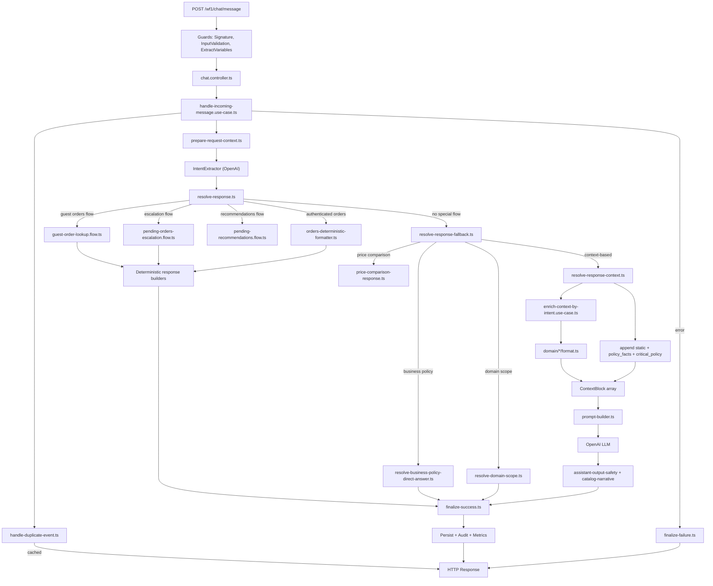
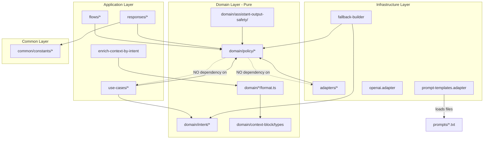

# WF1 Backend: SSOT Refactor and Guardrails Simplification Plan

---

## A) Confirmation of Plan 1-4

**Location:** `[.cursor/plans/prompts_constants_flow_audit_7be4dc9c.plan.md](.cursor/plans/prompts_constants_flow_audit_7be4dc9c.plan.md)` (435 lines, 14 rounds of investigation)

**Validated findings:**

- Duplication matrix across 4 layers (prompt files, adapter defaults, domain constants, direct-answer/response builders) is accurate and confirmed by code inspection.
- 35 `.txt` prompt files + 1 `.yaml` canonical + 21 `constants.ts` files under `src/modules/wf1/` confirms the scale of the problem.
- All 14 rounds of findings are supported by evidence.
- The flow diagram in the plan correctly captures the runtime path: `PromptTemplatesAdapter -> enrich-context-by-intent -> domain format -> context blocks -> prompt-builder -> LLM`.

**Gaps / corrections:**

1. **Missing from the plan:** The plan does not quantify the **guardrails rigidity** problem. We found 10+ deterministic bypasses in `resolve-business-policy-direct-answer.ts` and `resolve-domain-scope.ts` that block LLM reasoning for valid nuanced questions.
2. **Missing from the plan:** No analysis of which guardrails are **essential vs harmful**. The plan treats all duplication equally without distinguishing security-critical from preference-level constraints.
3. **Missing from the plan:** No concrete test strategy. The plan mentions "tests would break" but doesn't propose characterization tests or golden test fixtures.
4. **Correction:** The plan states domain constants are "almost never used in the main path." This is accurate for text content, but domain constants like `CANONICAL_ORDER_STATE_LABELS`, `DEFAULT_PAYMENT_METHODS`, `WF1_ORDERS_CONTEXT_AI_MAX_ITEMS`, and `TICKET_ISSUE_LABELS` **are** used actively for structural/data mapping -- these should remain in domain.

---

## B) Map of the Current System (Chat Pipeline)



**Module responsibilities:**

| Layer         | Module                                                                                      | Responsibility                                     |
| ------------- | ------------------------------------------------------------------------------------------- | -------------------------------------------------- |
| Controller    | `chat.controller.ts`                                                                        | HTTP entry, guards, delegates to use case          |
| Orchestration | `handle-incoming-message.use-case.ts`                                                       | Main orchestrator                                  |
| Orchestration | `prepare-request-context.ts`                                                                | User context, history, intent extraction           |
| Orchestration | `resolve-response.ts`                                                                       | Routes to appropriate flow                         |
| Orchestration | `resolve-response-fallback.ts`                                                              | Continuation, price, policy, scope fallbacks       |
| Orchestration | `resolve-response-context.ts`                                                               | LLM-based response with context enrichment         |
| Orchestration | `finalize-success.ts` / `finalize-failure.ts`                                               | Sanitize, persist, audit                           |
| Flows         | `guest-order-lookup.flow.ts`                                                                | Guest order lookup state machine                   |
| Flows         | `pending-orders-escalation.flow.ts`                                                         | Cancelled order escalation                         |
| Flows         | `pending-recommendations.flow.ts`                                                           | Recommendations disambiguation                     |
| Flows         | `resolve-business-policy-direct-answer.ts`                                                  | Deterministic policy answers (10 patterns)         |
| Flows         | `resolve-domain-scope.ts`                                                                   | Smalltalk, hostile, out-of-scope                   |
| Responses     | `orders-*.ts`, `price-comparison-response.ts`, `recommendations-disambiguation-response.ts` | Build user-facing deterministic messages           |
| Context       | `enrich-context-by-intent.use-case.ts`                                                      | API calls + context block creation                 |
| Domain        | `domain/*/format.ts` (7 files)                                                              | Format API data into AI context strings            |
| Domain        | `domain/context-block/`                                                                     | Render, append, type context blocks                |
| Domain        | `domain/assistant-output-safety/`                                                           | Sanitize bot output (terms, greetings, catalog)    |
| Infra         | `prompt-templates.adapter.ts`                                                               | Load .txt files with DEFAULT fallbacks             |
| Infra         | `prompt-builder.ts`                                                                         | Assemble final prompt (history + context + system) |
| Infra         | `openai.adapter.ts`                                                                         | Call OpenAI API                                    |
| Infra         | `fallback-builder.ts`                                                                       | Per-intent fallback messages when LLM fails        |

---

## C) Duplication Matrix

### C.1 Business content duplicated across layers

| Item                             | Prompt file (.txt)                             | Adapter DEFAULT                                                | Domain constants                                       | Direct-answer / Response                                                                 | Tests/Docs                             | Risk                                          | SSOT proposed                                      | Action                  |
| -------------------------------- | ---------------------------------------------- | -------------------------------------------------------------- | ------------------------------------------------------ | ---------------------------------------------------------------------------------------- | -------------------------------------- | --------------------------------------------- | -------------------------------------------------- | ----------------------- |
| Store hours (L-V 10-19, S 10-17) | `static`, `store_info_hours`                   | `DEFAULT_STORE_INFO_HOURS_CONTEXT`                             | `store-info-context/constants`                         | `STORE_HOURS_POLICY_MESSAGE`                                                             | integration, docs (3 wrong variants)   | High: already drifted (docs say 11-18, 11-19) | Canonical YAML -> generated .txt                   | Eliminate 3 of 4 copies |
| Returns policy (30 days)         | `critical_policy`, `tickets_returns_policy`    | `DEFAULT_CRITICAL_POLICY_CONTEXT`, `DEFAULT_TICKETS_RETURNS_*` | `tickets-context/constants`                            | `RETURNS_POLICY_MESSAGE`                                                                 | integration, CAPACIDADES               | High: 5 copies                                | Same as above                                      |                         |
| Reservations (48h, 30%)          | `static`, `critical_policy`                    | `DEFAULT_POLICY_FACTS_SHORT_CONTEXT` (regex)                   | --                                                     | `RESERVATIONS_POLICY_MESSAGE`                                                            | integration, validate-business-prompts | High: 4+ copies + fragile regex               | Same                                               |                         |
| Payment methods                  | `payment_shipping_payment`                     | `DEFAULT_PAYMENT_CONTEXT`                                      | `payment-shipping/constants` `DEFAULT_PAYMENT_METHODS` | --                                                                                       | unit, integration                      | Medium: 3 copies                              | `.txt` as SSOT; domain keeps only structural array |                         |
| Shipping (DHL, cost, pickup)     | `payment_shipping_shipping`, `cost`, `general` | `DEFAULT_SHIPPING_CONTEXT`, `DEFAULT_COST_CONTEXT`             | `payment-shipping/constants`                           | `SHIPPING_COST_MESSAGE`, `PICKUP_STORE_MESSAGE`, `INTERNATIONAL_SHIPPING_MESSAGE`        | integration, CAPACIDADES               | High: 5+ copies                               | `.txt` as SSOT                                     |                         |
| Contact info (WhatsApp, email)   | `static`, `tickets`, `escalation`              | `DEFAULT_STATIC_CONTEXT`                                       | --                                                     | `SHARED_GUIDANCE_LINES`, escalation responses                                            | 20+ test files, docs                   | High: URL/email in 20+ places                 | Env var + shared constant                          |                         |
| "Catalog unavailable" message    | --                                             | --                                                             | `recommendations/constants`                            | `error-mapper` `CATALOG_UNAVAILABLE_MESSAGE`                                             | seeds, RECOMENDACIONES                 | Medium: 4 variants                            | Single constant in `error-mapper`                  |                         |
| "Backend error" message          | --                                             | --                                                             | --                                                     | `error-mapper` `BACKEND_ERROR_MESSAGE` + `http-exception.filter` `SAFE_FALLBACK_MESSAGE` | tests                                  | Medium: 2 identical strings                   | Import from one place                              |                         |

### C.2 Instructions/rules duplicated across prompts

| Instruction                                       | Occurrences                                              | Risk   | Action                                                       |
| ------------------------------------------------- | -------------------------------------------------------- | ------ | ------------------------------------------------------------ |
| "Responder breve y claro, en espanol rioplatense" | 8+ prompt files + 5+ `constants.ts` + `openai/constants` | High   | Single `TONE_INSTRUCTION` in system prompt only              |
| "Pedir una sola aclaracion corta"                 | 10+ prompt files + `constants.ts` + `validate-prompts`   | High   | Single instruction in system prompt                          |
| "Instrucciones para tu respuesta:" header         | 6 domain format files + prompt files                     | Medium | System-level convention, not per-block                       |
| "hay stock / quedan pocas unidades / sin stock"   | `UiAvailabilityLabel` type + 6 files + validator         | Medium | `UiAvailabilityLabel` as SSOT; prompts reference dynamically |

### C.3 Structural coupling (copy <-> logic)

| Coupling                                                                                       | Location                                  | Risk                                     | Action                                             |
| ---------------------------------------------------------------------------------------------- | ----------------------------------------- | ---------------------------------------- | -------------------------------------------------- |
| `shouldSuggestCancelledOrderEscalation()` checks "queres que consulte", "area correspondiente" | `resolve-orders-escalation-flow-state.ts` | High: copy change breaks flow            | Use metadata flag instead of parsing bot message   |
| `shouldRetryLlmWithGuidance()` checks "te ayudo con consultas", "contame un poco mas"          | `resolve-response-context.ts`             | High: copy change breaks retry           | Use LLM response metadata/classification           |
| `PROMPTED_FRANCHISE_PATTERNS` regex on bot message                                             | `recommendations-memory.ts`               | High: copy change breaks extraction      | Persist franchise in metadata, not parse from text |
| `NEGATIVE_STOCK_PATTERN` regex on bot message                                                  | `catalog-narrative.ts`                    | Medium: copy change breaks sanitization  | Use structured LLM output (tool calls or JSON)     |
| `buildPolicyFactsShortContext()` regex extraction                                              | `prompt-templates.adapter.ts`             | Medium: prompt rewrite breaks extraction | Derive from canonical YAML sections                |

---

## D) Target Architecture (SSOT + Layers)

### D.1 Proposed folder structure (new/changed files only)

```
src/
  common/
    constants/
      contact.constants.ts          # NEW: BASE_URL, CONTACT_EMAIL, WHATSAPP
      error-messages.constants.ts    # NEW: BACKEND_ERROR, INVALID_PAYLOAD, etc.
  modules/wf1/
    domain/
      policy/                        # NEW: extracted from scattered locations
        business-facts.ts            # SSOT for returns, reservations, hours, shipping
        tone-instructions.ts         # SSOT for "breve y claro, rioplatense", "una sola aclaracion"
        guardrails.ts                # Hard/soft constraints registry
      intent/
        constants.ts                 # KEEP: INTENT_NAMES (already canonical)
        fallback-messages.ts         # MOVE from infra/openai/fallback-builder
      context-block/
        types.ts                     # KEEP: ContextType (already canonical)
      */constants.ts                 # REDUCE: remove text content, keep only structural (arrays, labels, limits)
      */format.ts                    # SIMPLIFY: remove resolveTemplates fallback; require templates param
    application/
      use-cases/handle-incoming-message/
        flows/policy/
          resolve-business-policy-direct-answer.ts  # REFACTOR: read from policy/business-facts
        responses/                   # REFACTOR: read user-facing strings from policy module
        support/
          error-mapper.ts            # REFACTOR: import from common/constants
    infrastructure/
      adapters/
        prompt-templates/
          constants.ts               # REDUCE: only file paths + minimal 1-line fallbacks
          prompt-templates.adapter.ts # SIMPLIFY: no regex extraction; load from files only
        openai/
          constants.ts               # REDUCE: remove duplicate instructions; import from domain/policy
prompts/
  static/
    entelequia_business_context_canonical_v1.yaml  # SSOT for all business facts
  # All .txt files: generated from canonical OR manually maintained (one source per concept)
scripts/
  validate-prompts.ts               # REFACTOR: derive REQUIRED_PHRASES from canonical YAML
  validate-generated-business-prompts.ts  # REFACTOR: derive REQUIRED_BUSINESS_FACTS from canonical
```

### D.2 Dependency rules



**Key rule:** `domain/policy/` is the single import point for all business facts, tone rules, and guardrail definitions. No other module defines business content.

### D.3 Module responsibilities in target state

| Module                               | Contains                                                                    | Does NOT contain                         |
| ------------------------------------ | --------------------------------------------------------------------------- | ---------------------------------------- |
| `domain/policy/business-facts.ts`    | Structured business facts (hours, returns, reservations, shipping, contact) | Implementation details, formatting       |
| `domain/policy/tone-instructions.ts` | Canonical tone/style instructions ("rioplatense", "breve y claro")          | Per-intent variations                    |
| `domain/policy/guardrails.ts`        | Hard/soft constraint definitions, blocked terms                             | Detection logic (stays in safety module) |
| `domain/*/constants.ts`              | Structural data only (labels, limits, arrays)                               | Text content, fallback messages          |
| `prompt-templates/constants.ts`      | File paths, 1-line fallbacks ("Contexto no disponible")                     | Full text duplicates                     |
| `responses/*.ts`                     | Message templates referencing `policy/business-facts`                       | Hardcoded business info                  |
| `scripts/validate-*.ts`              | Validation logic reading from canonical YAML                                | Hardcoded fact patterns                  |

---

## E) Guardrails by Layers (Hard / Soft / Fallback)

### E.1 Hard constraints (KEEP - security/compliance, never bypass)

| Constraint                                          | Location                              | Behavior                       |
| --------------------------------------------------- | ------------------------------------- | ------------------------------ |
| Hostile/jailbreak detection                         | `resolve-domain-scope.ts`             | Block + fixed safe response    |
| "No inventes datos, precios, stock, horarios"       | System prompt                         | LLM instruction                |
| "No pidas credenciales, claves ni datos de tarjeta" | System prompt                         | LLM instruction                |
| Technical term sanitization                         | `assistant-output-safety/index.ts`    | Post-process replacement       |
| Blocked phrases (jailbreak markers)                 | `validate-prompts.ts` BLOCKED_PHRASES | CI gate                        |
| `requiresAuth` for unauthenticated order queries    | `orders-unauthenticated-response.ts`  | Deterministic (auth is binary) |
| Rate limiting on order lookups                      | `guest-order-lookup.flow.ts`          | Deterministic                  |

### E.2 Soft constraints (RELAX - make advisory, let LLM reason with context)

| Current constraint                               | Current behavior              | Proposed behavior                                                                                                                            |
| ------------------------------------------------ | ----------------------------- | -------------------------------------------------------------------------------------------------------------------------------------------- |
| Business policy direct answers (10 patterns)     | Deterministic bypass, no LLM  | **Inject policy context as high-priority block + let LLM answer.** If LLM response contradicts policy, post-process correction.              |
| Smalltalk detection (greeting, thanks, farewell) | Deterministic fixed responses | **Let LLM handle with system prompt guidance.** Faster, more natural. Keep only empty-text check as deterministic.                           |
| Out-of-scope detection                           | Deterministic redirect        | **Let LLM decide with "reconducir" instruction.** Keep hostile detection as hard constraint.                                                 |
| `NEGATIVE_STOCK_PATTERN` catalog override        | Replaces entire message       | **Only flag contradiction in metadata; let LLM self-correct on retry.** Keep for contradictions where UI shows stock but text says "no hay". |
| URL/bullet detection in catalog narrative        | Replaces entire message       | **Remove.** LLM should be able to include URLs and structured text.                                                                          |

### E.3 Fallback reasoning (NEW - when info is missing)

| Scenario                         | Current                                           | Proposed                                                                                                             |
| -------------------------------- | ------------------------------------------------- | -------------------------------------------------------------------------------------------------------------------- |
| Missing context block for intent | Return generic fallback message                   | **Call LLM with available context + "No tengo datos confirmados de [X], pero basandome en lo que se..." disclaimer** |
| API error from Entelequia        | `CATALOG_UNAVAILABLE_MESSAGE` fixed               | **Call LLM with partial context + "Ahora no pude consultar [X] en tiempo real" instruction**                         |
| Ambiguous user query             | `pedir una sola aclaracion corta`                 | **Keep but allow LLM to attempt a partial answer + clarification in same turn**                                      |
| No products match search         | `"No encontre productos para esa busqueda"` fixed | **Let LLM suggest alternatives, related categories, or ask for clarification**                                       |
| Order detail unavailable         | Fixed error message                               | **Let LLM explain what happened + suggest next steps**                                                               |

**Decision framework for the LLM:**

```
1. Do I have confirmed data in context? -> Use it, cite it
2. Is the question about security/credentials/payments? -> Hard constraint: refuse
3. Can I partially answer from available context? -> Answer with disclaimer
4. Do I need one clarification? -> Ask it (one, short)
5. Should I infer? -> Only for non-critical info, with "segun lo que tengo" disclaimer
6. Is this off-topic? -> Gently redirect (not a fixed string)
```

---

## F) Refactoring Plan (Zero Regressions, Incremental)

### Step 0: Characterization tests + golden fixtures (PREREQUISITE)

**Goal:** Lock current behavior before any changes.

**Files to create:**

- `test/characterization/direct-answers.golden.ts` - Snapshot every direct-answer message from `resolve-business-policy-direct-answer.ts`
- `test/characterization/domain-scope.golden.ts` - Snapshot every `SMALLTALK_RESPONSES`, `HOSTILE_RESPONSE`, `OUT_OF_SCOPE_RESPONSE`
- `test/characterization/error-messages.golden.ts` - Snapshot every message from `error-mapper.ts`
- `test/characterization/deterministic-responses.golden.ts` - Snapshot messages from all `responses/*.ts` builders

**Files to touch:** None existing (only new test files)

**Risk:** None (additive only)

**Validation:**

```bash
npm run test:unit -- --testPathPattern=test/characterization
```

**Done when:** All golden tests pass, covering every deterministic user-facing string.

---

### Step 1: Extract `domain/policy` SSOT module (no behavior change)

**Goal:** Create a single source of truth for business facts and tone instructions. All existing consumers keep working through re-exports.

**Files to create:**

- `src/modules/wf1/domain/policy/business-facts.ts` - Export structured business facts (hours, returns, reservations, shipping, contact info)
- `src/modules/wf1/domain/policy/tone-instructions.ts` - Export `TONE_RIOPLATENSE`, `SINGLE_CLARIFICATION`, `INSTRUCTION_HEADER`
- `src/modules/wf1/domain/policy/index.ts` - Barrel export
- `src/common/constants/contact.constants.ts` - Export `BASE_URL`, `CONTACT_EMAIL`, `WHATSAPP_NUMBER`
- `src/common/constants/error-messages.constants.ts` - Export `BACKEND_ERROR_MESSAGE`, `INVALID_PAYLOAD_MESSAGE`, `INVALID_CREDENTIALS_MESSAGE`

**Files to modify:**

- `src/modules/wf1/application/use-cases/handle-incoming-message/flows/policy/resolve-business-policy-direct-answer.ts` - Import from `domain/policy` instead of inline strings
- `src/modules/wf1/application/use-cases/handle-incoming-message/support/error-mapper.ts` - Import from `common/constants`
- `src/common/filters/http-exception.filter.ts` - Import `BACKEND_ERROR_MESSAGE` from `common/constants`
- `src/modules/wf1/application/use-cases/handle-incoming-message/responses/orders/orders-unauthenticated-response.ts` - Import contact info from `common/constants`

**Risk:** Low (only changing import sources; values identical)

**Validation:**

```bash
npm run test:unit && npm run test:integration -- --runInBand
```

**Done when:** All existing tests pass. No string values changed, only import paths.

---

### Step 2: Reduce domain constants to structural-only

**Goal:** Remove text content from `domain/*/constants.ts` that duplicates prompt files. Keep only structural data (labels, limits, arrays).

**Files to modify:**

- `src/modules/wf1/domain/store-info-context/constants.ts` - Remove `DEFAULT_STORE_INFO_LOCATION_CONTEXT`, `DEFAULT_STORE_INFO_HOURS_CONTEXT`, etc. Keep nothing (all text comes from adapter)
- `src/modules/wf1/domain/payment-shipping-context/constants.ts` - Remove text defaults. Keep `DEFAULT_PAYMENT_METHODS` (structural array), `DEFAULT_API_FALLBACK_NOTE`
- `src/modules/wf1/domain/tickets-context/constants.ts` - Remove text defaults. Keep `TICKET_ISSUE_LABELS`, `TICKET_PRIORITY_LABELS`
- `src/modules/wf1/domain/recommendations-context/constants.ts` - Remove text defaults. Keep `WF1_RECOMMENDATIONS_CONTEXT_AI_MAX_ITEMS`
- `src/modules/wf1/domain/orders-context/constants.ts` - Remove text defaults. Keep `CANONICAL_ORDER_STATE_LABELS`, `WF1_ORDERS_CONTEXT_AI_MAX_ITEMS`, fallback labels
- `src/modules/wf1/domain/*/format.ts` - Make `templates` parameter required (remove `resolveTemplates` fallback pattern)

**Risk:** Medium - tests that assert domain DEFAULT content will break

**Validation:**

```bash
npm run test:unit -- --testPathPattern="domain/(store-info|payment-shipping|tickets|recommendations|orders)-context"
```

**Done when:** Tests updated to expect content from adapter, not domain defaults. Format functions require templates parameter.

---

### Step 3: Reduce adapter constants to minimal fallbacks

**Goal:** `prompt-templates/constants.ts` contains only file paths and 1-line fallback strings.

**Files to modify:**

- `src/modules/wf1/infrastructure/adapters/prompt-templates/constants.ts` - Replace multi-line DEFAULT with `'Contexto no disponible'`
- `src/modules/wf1/infrastructure/adapters/prompt-templates/prompt-templates.adapter.ts` - Remove `buildPolicyFactsShortContext()` regex extraction; load policy_facts from a dedicated `.txt` file instead
- `src/modules/wf1/infrastructure/adapters/openai/constants.ts` - Remove duplicate tone instructions; import from `domain/policy`
- `prompts/static/entelequia_policy_facts_v1.txt` - NEW: explicit policy facts file (replaces regex extraction)

**Risk:** Medium - if a `.txt` file is missing in an environment, the 1-line fallback changes behavior

**Validation:**

```bash
npm run test:unit && npm run test:integration -- --runInBand && npm run prompts:validate:entelequia
```

**Done when:** `prompt-templates/constants.ts` is under 100 lines. No regex extraction. All environments have `.txt` files.

---

### Step 4: Decouple flow logic from bot message copy

**Goal:** Replace substring/regex checks on bot messages with metadata flags.

**Files to modify:**

- `src/modules/wf1/application/use-cases/handle-incoming-message/flows/orders/resolve-orders-escalation-flow-state.ts` - Use `metadata.offeredEscalation: boolean` instead of checking "queres que consulte"
- `src/modules/wf1/application/use-cases/handle-incoming-message/orchestration/resolve-response-context.ts` - Use `metadata.llmPath` or `metadata.responseType` instead of checking "te ayudo con consultas"
- `src/modules/wf1/application/use-cases/handle-incoming-message/flows/recommendations/recommendations-memory.ts` - Persist `promptedFranchise` in metadata instead of regex on bot message
- `src/modules/wf1/application/use-cases/handle-incoming-message/orchestration/finalize-success.ts` - Set metadata flags when producing deterministic responses

**Risk:** High - state machine behavior could change if metadata is not set correctly

**Validation:**

```bash
npm run test:unit && npm run test:integration -- --runInBand && npm run test:e2e -- --runInBand
```

**Done when:** No flow logic reads `row.content` or `latestBotMessage` for substring matching (except `assistant-output-safety` which is post-processing, not flow control).

---

### Step 5: Simplify guardrails (soft constraints -> LLM context)

**Goal:** Convert 10 direct-answer patterns to LLM-with-policy-context. Keep hard constraints.

**Files to modify:**

- `src/modules/wf1/application/use-cases/handle-incoming-message/flows/policy/resolve-business-policy-direct-answer.ts` - Remove or feature-flag deterministic bypasses. Instead, inject a high-priority "policy facts" context block and let LLM answer.
- `src/modules/wf1/application/use-cases/handle-incoming-message/flows/policy/resolve-domain-scope.ts` - Remove smalltalk deterministic responses. Keep hostile detection. Let LLM handle greetings/thanks/farewells.
- `src/modules/wf1/domain/assistant-output-safety/catalog-narrative.ts` - Remove URL/bullet detection override. Keep NEGATIVE_STOCK_PATTERN but make it a warning flag in metadata instead of message replacement.
- `prompts/system/entelequia_assistant_system_prompt_v1.txt` - Add fallback reasoning instructions (see section E.3)

**Risk:** High - LLM responses for policy questions may vary. Requires eval testing.

**Validation:**

```bash
npm run test:unit && npm run test:integration -- --runInBand && npm run test:e2e -- --runInBand
# Plus manual eval of 20 policy questions against golden expected answers
```

**Done when:** Policy questions go through LLM with context. Hostile detection still deterministic. Eval scores >= baseline.

---

### Step 6: Unify validators + update docs + CI

**Goal:** Validators read from canonical YAML. Docs aligned.

**Files to modify:**

- `scripts/validate-prompts.ts` - Derive `REQUIRED_PHRASES_RULES` from canonical YAML sections instead of hardcoded arrays
- `scripts/validate-generated-business-prompts.ts` - Derive `REQUIRED_BUSINESS_FACTS` from canonical YAML
- `docs/CAPACIDADES_Y_ACCIONES_CHATBOT_ENTELEQUIA.md` - Align with canonical
- `docs/radriografia_nodo.md` - Fix Saturday hours to 10-17
- `docs/QA_findings.md` - Align hours and expected messages
- `docs/qa/learning-seed-cases.jsonl` - Update `expected_response_example` for changed flows

**Risk:** Low (docs + validators only)

**Validation:**

```bash
npm run prompts:validate:entelequia && npm run wf1:learning:validate-seeds && npm run verify:premerge
```

**Done when:** `verify:premerge` passes. All docs show consistent hours/policies.

---

## G) Validation Checklist

### Unit tests

- All existing unit tests pass (`npm run test:unit`)
- New characterization/golden tests cover every deterministic message
- Domain format functions tested with required `templates` parameter
- `domain/policy` module has unit tests for exported facts

### Integration tests

- `handle-incoming-message.integration.spec.ts` passes
- Tests updated to import expected strings from SSOT modules (not inline)
- New integration tests for "policy question -> LLM with context" flow

### E2E tests

- `wf1.e2e-spec.ts` passes
- E2E covers at least 3 policy questions through LLM path

### Eval / golden tests

- Create eval suite: 30 representative queries (10 policy, 10 product, 10 orders)
- Baseline scores captured before Step 5
- Post-Step-5 scores >= baseline for accuracy, relevance, tone
- `learning-seed-cases.jsonl` aligned with actual behavior

### CI / scripts

- `npm run prompts:validate:entelequia` passes
- `npm run wf1:learning:validate-seeds` passes
- `npm run verify:premerge` passes end-to-end
- No new linter warnings

### Metrics / telemetry

- `llmPath` distribution: monitor shift from `fallback_default` to `structured_success`
- Response latency: policy questions may be slower (LLM call vs deterministic)
- Error rate: no increase in `finalize-failure` count
- Token usage: monitor increase from policy-context injection

---

## H) External Best Practices (Research Summary)

### Prompt modularization (Prompt-Layered Architecture)

- **Pattern:** Treat prompts as composable, versionable components -- not monolithic strings.
- **Application:** Our SSOT canonical YAML + generated `.txt` files follows this. Each "slot" (products, orders, etc.) is a component. The prompt-builder assembles them at runtime.
- **Recommendation:** Formalize the `.txt` files as "prompt components" with metadata (version, owner, last-changed). The canonical YAML is the composition layer.

### Guardrails layering (OpenGuardrails / NeMo Guardrails)

- **Pattern:** Separate safety guardrails (input/output) from behavioral constraints. Use configurable per-request policies rather than hardcoded checks.
- **Key finding:** "No free lunch with guardrails" -- strengthening security constraints always reduces usability. The solution is explicit trade-off management via hard/soft/fallback layers.
- **Application:** Our Step 5 implements this: hostile detection = hard rail (NeMo-style "topic rail"), policy questions = soft rail (context injection, not blocking).

### Evaluation-driven development

- **Pattern:** Every guardrail change must be validated against a regression suite of representative queries with expected behavior scores.
- **Application:** Step 0 (characterization tests) + the eval suite in Step 5 + `learning-seed-cases.jsonl` as the golden set. Run evals as part of CI.

### Checklist for further research (Perplexity/web)

- "Prompt component registry patterns for NestJS" -- tooling for versioning prompt files
- "LLM structured output for metadata flags" -- using tool calls or JSON mode to get `offeredEscalation: true` instead of parsing bot text
- "Canonical YAML to prompt generation pipelines" -- existing tools (PromptLayer, Humanloop) for our generate-prompts pattern
- "Eval frameworks for customer-service chatbots 2025" -- braintrust, promptfoo, ragas for our eval needs
- "Feature flags for guardrail rollout" -- safely toggling between deterministic and LLM-based policy answers
