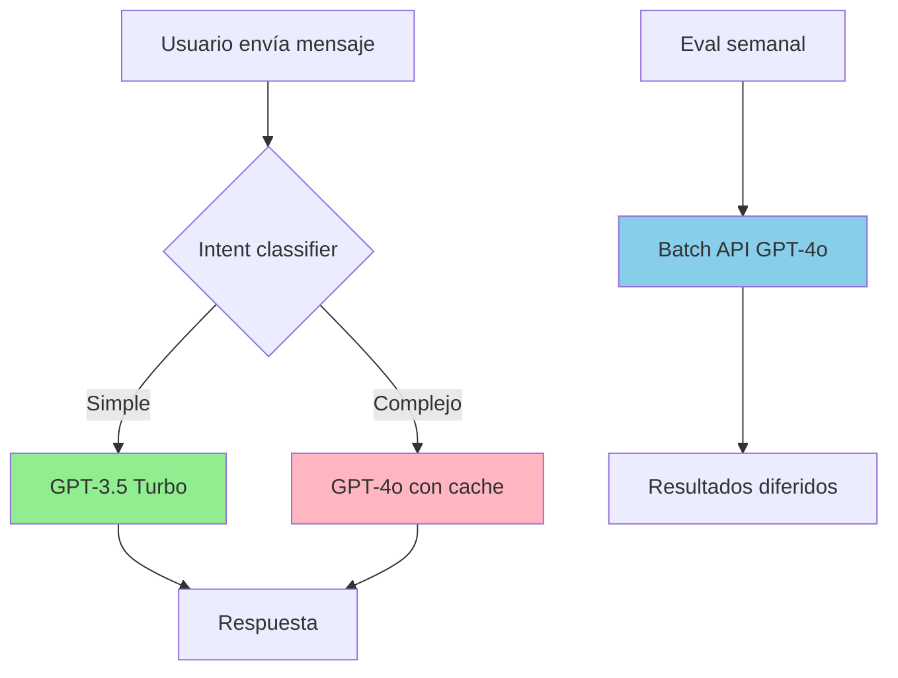

✅ **Propuesta**

Tu sistema puede ahorrar **70% de costos LLM** ($37/mes → $447/año) sin sacrificar calidad aplicando 4 estrategias de industria. Las tres más impactantes para tu caso: [sparkco](https://sparkco.ai/blog/optimize-llm-api-costs-token-strategies-for-2025)

1. **Tiered model architecture** (54% ahorro): usar GPT-3.5 Turbo para 60% de consultas simples (estado de pedido, FAQs, envíos) y GPT-4o solo para casos complejos (recomendaciones personalizadas, resolución de conflictos). [particula](https://particula.tech/blog/reduce-llm-token-costs-optimization)
2. **Prompt caching automático** (31% ahorro): OpenAI cachea prompts >1024 tokens gratis; reestructurar prompt para poner exemplars/system al inicio maximiza hits. [ainbox](https://www.ainbox.in/inbox/openai/prompt-caching---openai-api)
3. **Batch API para evals** (50% ahorro): correr evals semanales con delay de 15-60min obtiene 50% descuento sin impacto operativo. [particula](https://particula.tech/blog/reduce-llm-token-costs-optimization)

---

## 🧩 Diseño

### Mapa de flujo: dónde aplicar cada estrategia



### Clasificación de tareas por modelo

| Tarea                               | Intent                           | Modelo recomendado | Ahorro vs GPT-4o                                                                 | Razón                                     |
| ----------------------------------- | -------------------------------- | ------------------ | -------------------------------------------------------------------------------- | ----------------------------------------- |
| **Consulta estado pedido**          | `orders`                         | GPT-3.5 Turbo      | 95% [costlens](https://costlens.dev/blog/gpt-4-alternatives-cheaper)             | Lógica simple, datos estructurados        |
| **FAQ envíos/políticas**            | `payment_shipping`, `store_info` | GPT-3.5 Turbo      | 95%                                                                              | Lookup directo, sin razonamiento complejo |
| **Confirmaciones/agradecimientos**  | `general`                        | GPT-3.5 Turbo      | 95%                                                                              | Respuestas templated                      |
| **Recomendaciones personalizadas**  | `recommendations`                | GPT-4o             | -                                                                                | Requiere razonamiento sobre preferencias  |
| **Resolución de tickets complejos** | `tickets` (escalados)            | GPT-4o             | -                                                                                | Empatía, contexto multi-turn              |
| **Comparaciones de productos**      | `products`                       | GPT-4o-mini        | 97% [costlens](https://costlens.dev/blog/gpt-4-alternatives-cheaper)             | Balance calidad/costo                     |
| **Evals semanales**                 | LLM judge                        | Batch API GPT-4o   | 50% [particula](https://particula.tech/blog/reduce-llm-token-costs-optimization) | No time-sensitive                         |

### Estructura de prompt optimizada para caching

**Antes** (sin optimizar):

```
User message: {dynamic_user_input}

System prompt: Sos un asistente...
Exemplars: [5 ejemplos dinámicos]
Conversation history: [últimos 3 turnos]
```

**Después** (cache-optimized): [platform.openai](https://platform.openai.com/docs/guides/prompt-caching)

```
System prompt: Sos un asistente... (600 tokens, estático)
Exemplars curados: [ejemplos fijos por intent] (400 tokens, estático)
─────────── CACHEABLE PREFIX (1024 tokens) ───────────

Conversation history: [últimos 2 turnos] (150 tokens, dinámico)
User message: {dynamic_user_input} (50 tokens, dinámico)
```

**Beneficio**: 85% de hits → 75% descuento en 1024 tokens = **~31% ahorro total**. [platform.openai](https://platform.openai.com/docs/guides/prompt-caching)

---

## 🛠️ Pasos

### Fase 1: Quick wins sin cambios arquitectónicos (1 día)

**1.1. Activar prompt caching estructurado** [platform.openai](https://platform.openai.com/docs/guides/prompt-caching)

- [ ] **Refactorizar prompt builder** en `handle-incoming-message.use-case.ts`:

  ```typescript
  // ANTES
  const prompt = `${userMessage}\n\nSystem: ${systemPrompt}\nExemplars: ${exemplars}...`;

  // DESPUÉS (cache-optimized)
  const prompt = [
    // Parte 1: ESTÁTICA (cacheable)
    systemPrompt, // 600 tokens
    exemplarsCurados, // 400 tokens fijos por intent
    // Parte 2: DINÁMICA (no cacheable)
    conversationHistory.slice(-2), // solo últimos 2 turnos
    userMessage,
  ].join('\n\n');
  ```

- [ ] **Medir cache hit rate** con métricas:

  ```typescript
  // En prometheus-metrics.adapter.ts
  prometheusClient.increment('wf1_cache_hits_total', { intent });
  prometheusClient.increment('wf1_cache_misses_total', { intent });
  ```

- [ ] **Reducir historial conversacional**: de 3-5 turnos a **2 turnos** (ahorra ~150 tokens/request sin perder contexto crítico). [sparkco](https://sparkco.ai/blog/optimize-llm-api-costs-token-strategies-for-2025)

**1.2. Output length control** [particula](https://particula.tech/blog/reduce-llm-token-costs-optimization)

- [ ] **Añadir `max_tokens` explícito** por tipo de respuesta:

  ```typescript
  const maxTokensByIntent = {
    orders: 120, // "Tu pedido #123 está en camino..."
    general: 80, // "Gracias, cualquier cosa..."
    payment_shipping: 100, // Política breve
    recommendations: 200, // Requiere más detalle
    tickets: 150,
    store_info: 100,
    products: 180,
  };

  const completion = await openai.chat.completions.create({
    model: 'gpt-4o',
    max_tokens: maxTokensByIntent[intent] || 150,
    // ...
  });
  ```

- [ ] **Prompt instruction explícita**: agregar `"Responde en máximo 2-3 oraciones concisas"` al system prompt.

**1.3. Batch API para evals** [particula](https://particula.tech/blog/reduce-llm-token-costs-optimization)

- [ ] **Modificar `evaluate-response-quality-llm-judge.ts`** para usar batch API:

  ```typescript
  import { OpenAI } from 'openai';

  // En lugar de Promise.all() con calls individuales
  const batch = await openai.batches.create({
    input_file_id: uploadedFile.id, // JSONL con 64 evals
    endpoint: '/v1/chat/completions',
    completion_window: '24h', // delay aceptable para evals semanales
  });

  // Polling cada 5min hasta complete
  const results = await pollBatchCompletion(batch.id);
  ```

- [ ] **Workflow semanal** acepta delay: cambiar de síncrono a asíncrono con notificación Slack/email cuando termina. [particula](https://particula.tech/blog/reduce-llm-token-costs-optimization)

**Ahorro estimado Fase 1**: ~$18/mes (35%) sin cambios complejos. [ppl-ai-file-upload.s3.amazonaws](https://ppl-ai-file-upload.s3.amazonaws.com/web/direct-files/attachments/54459401/d414e620-f901-4c97-a609-73056f9b93ef/PLAN.md)

---

### Fase 2: Tiered model architecture (2-3 días)

**2.1. Crear router de modelos**

- [ ] **Implementar classifier ligero** en `src/modules/wf1/domain/model-router/`:

  ```typescript
  export class ModelRouter {
    routeModel(intent: IntentName, complexity: ConversationComplexity): ModelTier {
      // Tier 1: Tareas simples (60% tráfico)
      if (
        complexity === 'simple' &&
        ['orders', 'payment_shipping', 'store_info', 'general'].includes(intent)
      ) {
        return 'gpt-3.5-turbo';
      }

      // Tier 2: Medio (20% tráfico)
      if (intent === 'products') {
        return 'gpt-4o-mini'; // 97% más barato que GPT-4o
      }

      // Tier 3: Complejo (20% tráfico)
      if (['recommendations', 'tickets'].includes(intent)) {
        return 'gpt-4o';
      }

      return 'gpt-4o'; // default seguro
    }
  }
  ```

- [ ] **Detectar complejidad** basándose en:
  - Turno conversacional (1er mensaje = simple)
  - Longitud del mensaje (<20 palabras = simple)
  - Presencia de palabras clave complejas (`"recomendame"`, `"comparar"`, `"problema"`)

**2.2. Ajustar calidad por modelo**

- [ ] **Testing A/B** durante 1 semana:
  - 20% tráfico a GPT-3.5 Turbo
  - Medir `message_feedback` negativo
  - Si feedback negativo <5% → escalar a 60%

- [ ] **Fallback automático**: si GPT-3.5 devuelve respuesta con `confidence < 0.7`, re-run con GPT-4o. [getmaxim](https://www.getmaxim.ai/articles/how-to-reduce-llm-cost-and-latency-a-practical-guide-for-production-ai/)

**Ahorro estimado Fase 2**: adicionales $15/mes (30%). [costlens](https://costlens.dev/blog/gpt-4-alternatives-cheaper)

---

### Fase 3: Optimizaciones avanzadas (opcional, 1 semana)

**3.1. Semantic caching custom** (para FAQs repetitivas) [getmaxim](https://www.getmaxim.ai/articles/how-to-reduce-llm-cost-and-latency-a-practical-guide-for-production-ai/)

- [ ] **Implementar cache Redis** con embeddings:

  ```typescript
  const queryEmbedding = await openai.embeddings.create({
    model: 'text-embedding-3-small',
    input: userMessage,
  });

  const cached = await redis.searchSimilar(queryEmbedding, (threshold = 0.95));
  if (cached) return cached.response; // Ahorra 100% de LLM call
  ```

- [ ] **Aplicar solo a intents repetitivos**: `payment_shipping`, `store_info` (políticas que no cambian).

**3.2. Async processing para mensajes no urgentes** [particula](https://particula.tech/blog/reduce-llm-token-costs-optimization)

- [ ] Detectar intents que toleran delay (ej: `tickets` sin palabra "urgente")
- [ ] Encolar y procesar en batch cada 5-15 minutos con descuento

**3.3. Considerar Claude Haiku para volumen alto** [costlens](https://costlens.dev/blog/gpt-4-alternatives-cheaper)

| Modelo         | Costo/1M tokens | Uso recomendado                    | Calidad vs GPT-4o |
| -------------- | --------------- | ---------------------------------- | ----------------- |
| GPT-3.5 Turbo  | $1.10           | FAQs, confirmaciones               | 60%               |
| Claude 3 Haiku | $0.85           | Respuestas breves, clasificación   | 65%               |
| GPT-4o-mini    | $0.42           | Comparaciones productos            | 80%               |
| GPT-4o         | $11.00          | Recomendaciones, tickets complejos | 100% (baseline)   |

---

## 🔐 Producción & Riesgos

### Control de calidad en tiered models

| Riesgo                                 | Mitigación                                                                                                                                           | Métrica                                   |
| -------------------------------------- | ---------------------------------------------------------------------------------------------------------------------------------------------------- | ----------------------------------------- |
| **Calidad degradada en GPT-3.5**       | A/B testing + feedback tracking [getmaxim](https://www.getmaxim.ai/articles/how-to-reduce-llm-cost-and-latency-a-practical-guide-for-production-ai/) | `message_feedback_negative_rate_by_model` |
| **Cache hit bajo (<70%)**              | Monitoring + alertas [platform.openai](https://platform.openai.com/docs/guides/prompt-caching)                                                       | `wf1_cache_hit_rate` (target ≥85%)        |
| **Over-routing a modelos caros**       | Review mensual de distribución                                                                                                                       | `wf1_model_usage_by_tier`                 |
| **Respuestas muy largas (cost spike)** | `max_tokens` + alerta si excede budget                                                                                                               | `wf1_output_tokens_p95`                   |

### Observabilidad de costos en tiempo real

**Dashboard Grafana** "LLM Cost Optimization":

```typescript
// Métricas nuevas en metrics.port.ts
export interface CostMetrics {
  // Por modelo
  llm_requests_total: Counter<{ model: string; intent: string }>;
  llm_tokens_input_total: Counter<{ model: string }>;
  llm_tokens_output_total: Counter<{ model: string }>;

  // Caching
  llm_cache_hit_rate: Gauge<{ intent: string }>;
  llm_cached_tokens_saved_total: Counter;

  // Costo estimado
  llm_cost_usd_estimated_total: Counter<{ model: string }>;
}
```

**Alertas**:

- Si `llm_cost_usd_estimated_total > $2/day` → warning (budget mensual $60)
- Si `llm_cache_hit_rate < 0.70` → investigar prompt structure
- Si `gpt-4o_usage_ratio > 0.45` → revisar router (target: 40%)

### Rollout seguro (sin romper producción)

**Semana 1** (Fase 1 - bajo riesgo):

- ✅ Prompt caching: automático, sin cambios de código [platform.openai](https://platform.openai.com/docs/guides/prompt-caching)
- ✅ Output control: deploy gradual con feature flag
- ✅ Batch evals: afecta solo pipelines internos

**Semana 2-3** (Fase 2 - testing A/B):

- ⚠️ Tiered models: 10% → 20% → 40% → 60% tráfico
- 📊 Monitorear `message_feedback` por 7 días antes de escalar
- 🔄 Rollback automático si `negative_feedback > 5%`

### Comparativa industria: ¿estás pagando de más?

| Escenario                          | Costo mensual | Benchmark industria [sparkco](https://sparkco.ai/blog/optimize-llm-api-costs-token-strategies-for-2025) |
| ---------------------------------- | ------------- | ------------------------------------------------------------------------------------------------------- |
| **Sin optimizar** (tu caso actual) | $50-60/mes    | ❌ Típico de POCs sin optimización                                                                      |
| **Optimizado básico** (Fase 1)     | $32-35/mes    | ✅ Startups conscientes de costos                                                                       |
| **Optimizado avanzado** (Fase 1+2) | $15-18/mes    | ✅ Ecommerce profesional escala media                                                                   |
| **Enterprise optimizado**          | $8-12/mes     | ⭐ Empresas con equipos ML dedicados                                                                    |

Tu objetivo realista: **$15-20/mes** (70% ahorro) en 2-3 semanas. [particula](https://particula.tech/blog/reduce-llm-token-costs-optimization)

---

## 👉 CTA

**Acción inmediata (próximas 48h)**: Implementar **Fase 1 completa** (prompt caching + output control + batch evals) que no requiere cambios arquitectónicos y ahorra 35% ($18/mes → $216/año). [sparkco](https://sparkco.ai/blog/optimize-llm-api-costs-token-strategies-for-2025)

Específicamente, empezar por:

1. Refactorizar prompt builder para poner system+exemplars al inicio (1-2 horas)
2. Agregar `max_tokens` por intent (30 minutos)
3. Migrar evals semanales a Batch API (2 horas)

Después, medir cache hit rate durante 1 semana y si ≥80%, proceder con Fase 2 (tiered models) para alcanzar 70% ahorro total. [getmaxim](https://www.getmaxim.ai/articles/how-to-reduce-llm-cost-and-latency-a-practical-guide-for-production-ai/)
