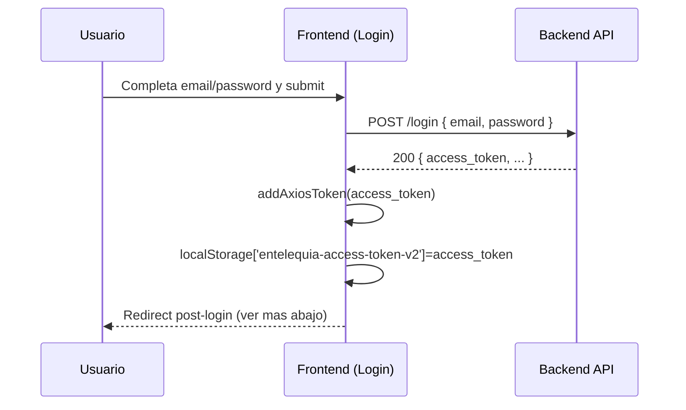
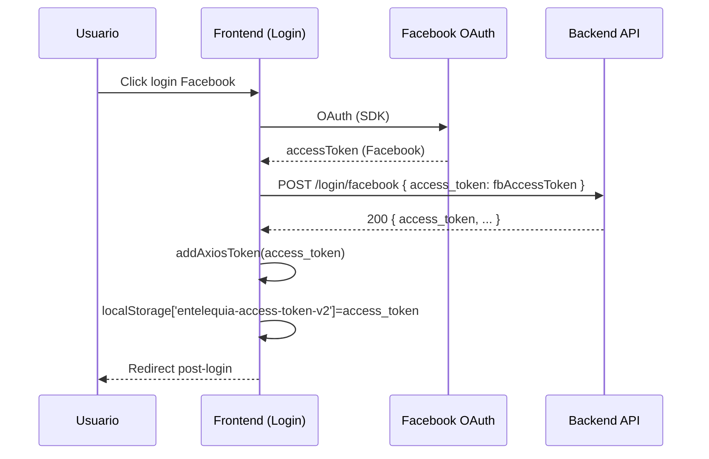
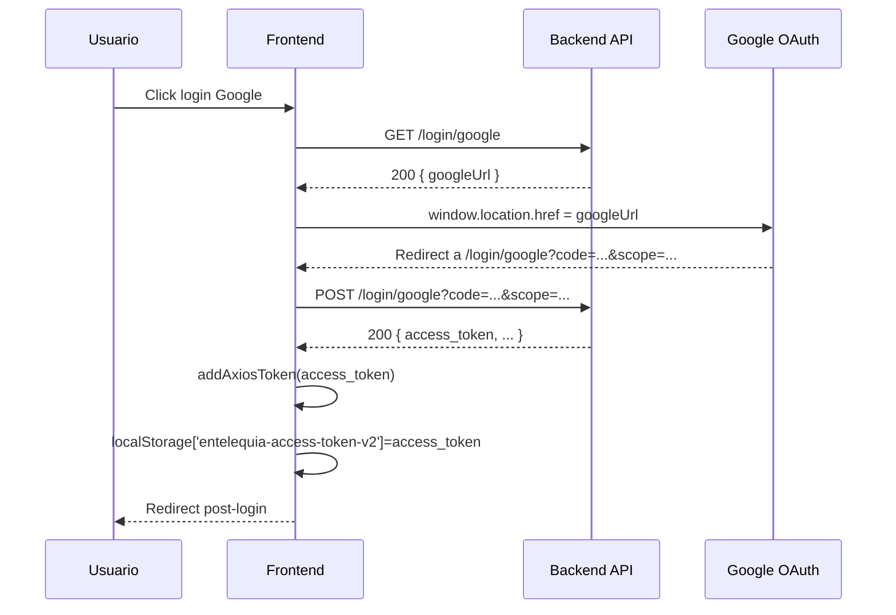
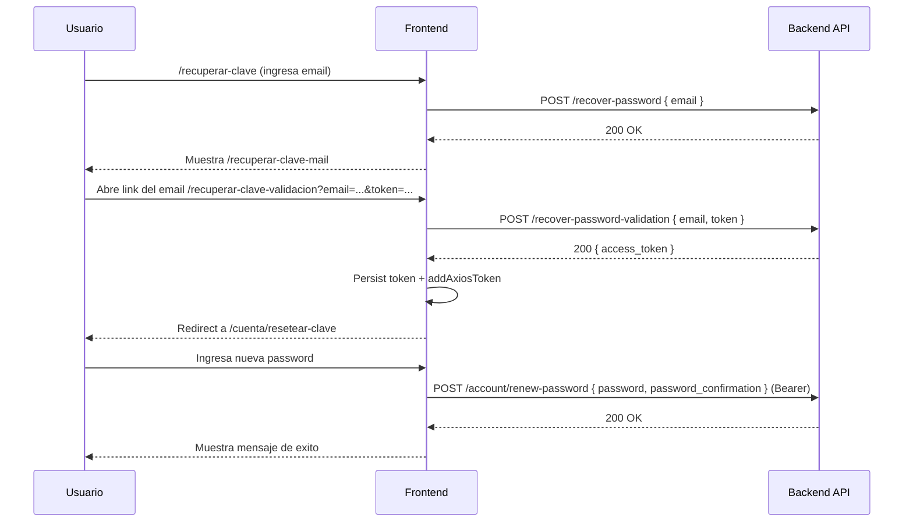

# Autenticacion (Frontend)

Este documento describe **como funciona hoy** la autenticacion en el frontend `entelequia_tienda` (React + Redux + Axios) y como se integra con el backend via un **access token tipo Bearer**.

Alcance:

- Login con email/password.
- Login con Facebook.
- Login con Google (OAuth redirect).
- Proteccion de rutas privadas (`/cuenta/*`).
- Persistencia y propagacion del token (localStorage + Axios).
- Recupero y reseteo de password.
- Logout.
- Integraciones relacionadas (Chatbot widget y `user_id` para analytics).

No alcance:

- Implementacion del backend (validacion de credenciales, emision/expiracion/refresh del JWT, scopes/roles, etc.). Se documenta lo que el frontend **asume** por el uso actual de endpoints.

## Resumen de arquitectura

- El frontend **no maneja sesiones por cookies**.
- La autenticacion es **token-based**: el backend retorna `access_token` y el frontend:
  1. lo guarda en `localStorage` (`entelequia-access-token-v2`)
  2. setea `Authorization: Bearer <token>` en Axios (default header)
- Las pantallas privadas viven bajo `/cuenta/*` y se protegen con `PrivateRoute`, que **solo verifica existencia** del token en `localStorage`.
- Axios tiene un interceptor global: si una respuesta es `401`, redirige a `/login`.
- No existe un "auth reducer" dedicado: la fuente de verdad en el FE es el **token en localStorage** + el header default de Axios. Los datos del usuario se obtienen via `/account/profile`.

## Mapa de archivos (donde vive la auth)

- Inicializacion de Axios (baseURL, interceptor, carga de token): `src/helpers/axios.js`
- Guard de rutas privadas: `src/routes/private-route.js`
- Rutas principales (incluye `/login`, `/login/google`, `/cuenta/*`): `src/routes/routes.js`
- Sub-rutas privadas dentro de `/cuenta/*`: `src/routes/user-routes.js`
- Acciones de auth (llamadas al backend + side effects de token): `src/actions/auth.js`
- Login UI (email/password + Facebook + Google button): `src/pages/login.js`
- Callback UI de Google (`/login/google`): `src/pages/login-google.js`
- Registro: `src/pages/registration.js`, `src/pages/registration-message.js`
- Recupero y reset password: `src/pages/recover-password.js`, `src/pages/recover-password-message.js`, `src/pages/recover-password-validation.js`, `src/pages/account/renew-password.js`
- Logout helper: `src/helpers/logout.js`
- Integracion Chatbot (bridge host y redirect post-login): `src/chatbot/host-context.js`, `src/chatbot/chatbot-widget-frame.js`, `src/index.js`

## Variables de entorno relevantes (Vite)

La app usa `import.meta.env.*`.

Auth/API:

- `VITE_APP_API_URL`
  - Usado por `src/helpers/domain.js` como `REACT_APP_API_URL`
  - Se concatena con `API_VERSION` para construir `axios.defaults.baseURL`
  - Recomendacion: que termine con `/` si se espera `.../api/`
- `VITE_APP_API_VERSION`
  - Usado por `src/config/index.js` como `API_VERSION`
  - Ej: `v1`
- `VITE_APP_BASENAME`
  - Usado por `src/history.js` para el `basename` del router (paths)
- `VITE_APP_FACEBOOK_APP_ID`
  - Usado por `src/pages/login.js` para inicializar el login de Facebook

Chatbot (relacionado con auth por el `accessToken`):

- `VITE_CHATBOT_ENABLED=true|false` (default `true`)
- `VITE_CHAT_WIDGET_URL` (default `/chatbot-widget/index.html`)
- `VITE_CHATBOT_WEBHOOK_URL` (default `http://localhost:3090/wf1/chat/message`)
- `VITE_CHATBOT_TURNSTILE_SITE_KEY` (opcional)

## Storage (localStorage keys)

Keys que afectan auth y contexto:

- `entelequia-access-token-v2`
  - Contiene el `access_token` (Bearer) retornado por backend.
  - Es la unica condicion para habilitar rutas privadas.
- `entelequia-user-id`
  - No es un token; se usa como `user_id` para analytics y como `userId` para chatbot cuando existe.
- `entelequia-chatbot-post-login`
  - Path a donde volver post-login cuando el chatbot exige autenticacion.
- `entelequia-chatbot-guest-id`
  - Guest id persistente para el chatbot (cuando no hay `entelequia-user-id`).
- `entelequia-currency`
  - Contexto no-auth, pero se envia al chatbot.

## Redux (como se consumen las acciones de auth)

Este proyecto usa `redux-promise-middleware` (ver `src/store.js`).

Patron actual:

- Las actions (por ejemplo `login(...)`) retornan un objeto `{ type, payload }` donde `payload` es un `Promise` de Axios.
- El middleware despacha automaticamente los estados:
  - `${TYPE}_PENDING`
  - `${TYPE}_FULFILLED`
  - `${TYPE}_REJECTED`
- En las pantallas de login/registro/checkout se suele usar:
  - `dispatch(actionCreator(...)).then((result) => ...)`
  - donde `result.value` es lo que retorno el `.then(...)` del action (ej: `response.data` o `response`).

## Inicializacion de Axios (baseURL + interceptor + token)

En el arranque del app, se ejecuta `initializeAxios()` en `src/routes/index.js` (constructor de `App`).

Comportamiento:

1. Setea `axios.defaults.baseURL` a:

```txt
${VITE_APP_API_URL}${VITE_APP_API_VERSION}
```

2. Registra un interceptor de respuestas:

- Si el error **no tiene** `error.response` (ej: no hay conectividad/CORS), muestra un modal via `react-confirm-alert`.
- Si el status es `401`, hace `history.push('/login')`.

3. Si existe `localStorage['entelequia-access-token-v2']`, llama `addAxiosToken(token)` para setear header default:

```http
Authorization: Bearer <token>
```

Referencia: `src/helpers/axios.js`

Nota de routing:

- El `Router` se monta con `forceRefresh={true}` en `src/routes/index.js`.
- Con `forceRefresh={true}`, la navegacion via `history.push(...)` hace un refresh completo (full page reload). Al recargar, se vuelve a ejecutar `initializeAxios()` y se vuelve a leer el token desde `localStorage`.

## Proteccion de rutas privadas (PrivateRoute)

Las rutas bajo `/cuenta/*` se montan en `src/routes/routes.js` con:

```jsx
<PrivateRoute path="/cuenta/" component={UserRoutes} />
```

`PrivateRoute` (archivo `src/routes/private-route.js`) funciona asi:

- Si existe `localStorage['entelequia-access-token-v2']`:
  - Renderiza el componente solicitado.
- Si no existe:
  - Redirige a `/login` (con `state.from`, pero hoy el login **no lo usa**).

Importante:

- No valida expiracion del token.
- No decodifica JWT.
- No consulta al backend para validar sesion.

## Flujo: Login con email/password

UI: `src/pages/login.js`
Accion: `src/actions/auth.js -> login(email, password)`
Endpoint: `POST /login`

Secuencia (alto nivel):



Detalles de implementacion:

- En `src/actions/auth.js`, el action hace side effects dentro del `.then()`:
  - guarda en `localStorage`
  - setea Axios header
- En `src/pages/login.js`, luego del `dispatch(login(...))` se valida:
  - `if (result.value.access_token != null) history.push(...)`

### Redirect post-login

El login decide el redirect asi:

1. Si existe `localStorage['entelequia-chatbot-post-login']`:
   - lo consume (lo borra) y redirige a ese path (si empieza con `/`)
2. Caso contrario:
   - redirige a `/cuenta/`

Referencia: `getPostLoginRedirectPath()` en `src/pages/login.js` y `src/pages/login-google.js`.

## Flujo: Login con Facebook

UI: `src/pages/login.js` (componente `@greatsumini/react-facebook-login`)
Accion: `src/actions/auth.js -> loginWithFacebook(access_token)`
Endpoint: `POST /login/facebook`

Secuencia:



Notas:

- El frontend no guarda informacion de perfil a partir de Facebook; solo usa el token de Facebook para que el backend emita su `access_token` propio.

## Flujo: Login con Google

Esto esta dividido en 2 pasos (redirect):

1. Pedir al backend la URL de Google para iniciar OAuth
2. Recibir callback en `/login/google` y canjear `code` por `access_token` propio

### Paso 1: obtener googleUrl y redirigir

UI: `src/components/GoogleLoginButton.js`
Accion: `src/actions/auth.js -> redirectToGoogleUrl()`
Endpoint: `GET /login/google`

- Si el backend responde `data.googleUrl`, el frontend hace:
  - `window.location.href = googleUrl`

### Paso 2: callback en /login/google

UI: `src/pages/login-google.js` (route `/login/google`)
Accion: `src/actions/auth.js -> loginWithGoogle(queryParams)`
Endpoint: `POST /login/google?<queryParams>`

Implementacion:

- `LoginGoogle` toma `window.location.search` y lo concatena al endpoint:
  - `axios.post('/login/google' + queryParamsString)`
- Si el backend responde `access_token`, se persiste igual que los otros login y se redirige post-login.

Secuencia completa:



## Flujo: Logout

Helper: `src/helpers/logout.js`

Comportamiento:

1. Elimina:
   - `localStorage['entelequia-access-token-v2']`
   - `localStorage['entelequia-user-id']`
2. Dispara `store.dispatch({ type: USER_LOGOUT })` para limpiar slices que lo escuchan.
3. Navega a `/login`.

Nota:

- No existe un "logout" en backend desde el frontend (no hay revoke/invalidate del token); es un logout local.

Reducers que resetean state en logout:

- `src/reducers/profile-show.js`
- `src/reducers/orders-list.js`
- `src/reducers/favorites-list.js`

## Flujo: Recupero de password

### 1) Solicitud de recupero

UI: `src/pages/recover-password.js` (route `/recuperar-clave`)
Accion: `src/actions/auth.js -> recoverPassword(email)`
Endpoint: `POST /recover-password { email }`

Si el request sale OK:

- Navega a `/recuperar-clave-mail` (mensaje al usuario).

### 2) Validacion del link (email + token)

UI: `src/pages/recover-password-validation.js` (route `/recuperar-clave-validacion`)
Accion: `src/actions/auth.js -> recoverPasswordValidation(email, token)`
Endpoint: `POST /recover-password-validation { email, token }`

Comportamiento:

- Lee `email` y `token` desde query params:
  - `/recuperar-clave-validacion?email=...&token=...`
- Si el backend responde `200` con `access_token`:
  - guarda token en `localStorage`
  - setea header Authorization
  - redirige a `/cuenta/resetear-clave` (ruta privada)

### 3) Resetear password (ya autenticado con token de recupero)

UI: `src/pages/account/renew-password.js` (route `/cuenta/resetear-clave`)
Accion: `src/actions/auth.js -> renewPassword(password, password_confirmation)`
Endpoint: `POST /account/renew-password`

Este endpoint asume header:

```http
Authorization: Bearer <access_token>
```

Secuencia completa:



## Manejo de errores de autenticacion (401)

Fuente: interceptor en `src/helpers/axios.js`.

Regla:

- Si cualquier request devuelve `401`:
  - navega a `/login`

Consideraciones:

- El token en `localStorage` **no se borra automaticamente** cuando llega un `401`.
- La proteccion de rutas (`PrivateRoute`) es por existencia del token, no por validez; por lo tanto, si el token esta vencido, el usuario puede:
  - entrar a `/cuenta/*` (si el token existe)
  - pero los requests a `/account/*` devolveran `401` y lo llevaran a `/login`

## Integracion con Chatbot (authMode + accessToken)

El chatbot corre en un iframe (`src/chatbot/chatbot-widget-frame.js`) y el host expone un bridge global.

Instalacion:

- `src/index.js` ejecuta `installChatbotHostBridge()` al arrancar.

Bridge global:

- `window.EntelequiaChatbotHost.getUserContext()`
  - Devuelve `{ userId, authMode, accessToken?, currency?, locale }`
  - `authMode` es:
    - `authenticated` si existe `entelequia-access-token-v2`
    - `guest` si no existe
- `window.EntelequiaChatbotHost.onAuthRequired()`
  - Guarda el path actual en `localStorage['entelequia-chatbot-post-login']`
  - Redirige a `/login`

Envio al Chatbot BE (`POST /wf1/chat/message`):

- Si hay sesion, el widget debe enviar el token solo por header:
  - `Authorization: Bearer <accessToken>`
- No incluir `accessToken` en body.
- Requests con `accessToken` en body son invalidos y reciben `400 Bad Request`.

Referencia: `src/chatbot/host-context.js`

## user_id (no es token) y su relacion con analytics/chatbot

`entelequia-user-id` se setea (cuando existe) desde:

- `src/components/notification-dropdown-v2.js`
  - Lee `response.value.user_id` del endpoint `/account/shop-notifications`
  - Si viene, lo guarda en `localStorage['entelequia-user-id']`
  - Si no viene, lo borra

Uso:

- GA4: `src/helpers/google-ga4.js` agrega `event.user_id` si esta disponible.
- Chatbot: `src/chatbot/host-context.js` usa `entelequia-user-id` como `userId` (si no existe, genera guest id persistente).

## Como extender o modificar el sistema (guia practica)

### Agregar una nueva ruta privada

1. Colocar la pantalla dentro de `src/routes/user-routes.js` bajo `/cuenta/...`
2. Asegurarse de que el endpoint backend correspondiente este bajo `/account/...` (si corresponde) y requiera Bearer.

### Hacer un request autenticado

No hay que pasar el token manualmente. Requisitos:

- Haber ejecutado `initializeAxios()` (ya sucede al montar el app).
- Tener token en `localStorage['entelequia-access-token-v2']` (login previo).

Axios enviara `Authorization: Bearer ...` automaticamente via `axios.defaults.headers.common`.

### Debug rapido (local)

- Ver token: DevTools -> Application -> Local Storage -> `entelequia-access-token-v2`
- Forzar logout: borrar `entelequia-access-token-v2` y refrescar.
- Simular "sin auth": abrir `/cuenta/` sin token y verificar redirect a `/login`.

## Limitaciones actuales (importante)

Estas limitaciones describen el comportamiento actual del frontend (no son propuestas):

- El "Remember me" del UI no cambia el comportamiento: el token siempre se guarda en `localStorage`.
- `PrivateRoute` valida solo existencia del token, no expiracion ni firma.
- No hay refresh token ni renovacion automatica del token.
- Un `401` redirige a `/login`, pero no limpia el token persistido.

## Endpoints usados por el frontend (auth y cuenta)

Los requests se hacen contra `axios.defaults.baseURL = ${VITE_APP_API_URL}${VITE_APP_API_VERSION}` y luego se usan paths relativos (ej: `POST /login` se convierte en `${baseURL}/login`).

Auth (publicos):

| Metodo | Path | Donde se usa | Notas |
| --- | --- | --- | --- |
| `POST` | `/login` | `src/actions/auth.js` | Email/password. Respuesta esperada: `{ access_token }`. |
| `POST` | `/login/facebook` | `src/actions/auth.js` | Recibe token de FB y retorna `{ access_token }` propio. |
| `GET` | `/login/google` | `src/actions/auth.js` | Respuesta esperada: `{ googleUrl }` para iniciar OAuth. |
| `POST` | `/login/google?<query>` | `src/actions/auth.js` | Canjea `code` por `{ access_token }`. |
| `POST` | `/registration` | `src/actions/auth.js` | Registro. No loguea automaticamente. |
| `POST` | `/recover-password` | `src/actions/auth.js` | Solicita email de recupero. |
| `POST` | `/recover-password-validation` | `src/actions/auth.js` | Valida link (`email + token`) y retorna `{ access_token }`. |

Cuenta (requieren Bearer):

| Metodo | Path | Donde se usa | Notas |
| --- | --- | --- | --- |
| `GET` | `/account/profile` | `src/actions/client.js` | Carga datos del usuario autenticado. |
| `POST` | `/account/account` | `src/actions/client.js` | Update perfil (multipart). |
| `PUT` | `/account/address` | `src/actions/client.js` | Update direccion. |
| `POST` | `/account/renew-password` | `src/actions/auth.js` | Reset password (pantalla `resetear-clave`). |
| `GET` | `/account/orders` | `src/actions/order.js` | Lista pedidos. |
| `GET` | `/account/orders/:id` | `src/actions/order.js` | Detalle pedido. |
| `POST` | `/account/orders` | `src/actions/order.js` | Crea pedido. |
| `GET` | `/account/favorites` | `src/actions/favorite.js` | Lista favoritos. |
| `PUT` | `/account/favorites/:productId` | `src/actions/favorite.js` | Agrega favorito. |
| `DELETE` | `/account/favorites/:productId` | `src/actions/favorite.js` | Borra favorito. |
| `POST` | `/account/order/confirm-address` | `src/actions/checkout.js` | Confirma direccion para checkout. |
| `GET` | `/account/shop-notifications` | `src/actions/shop-notification.js` | Tambien se usa para setear `entelequia-user-id`. |
| `DELETE` | `/account/shop-notifications/:id` | `src/actions/shop-notification.js` | Borra notificacion. |
