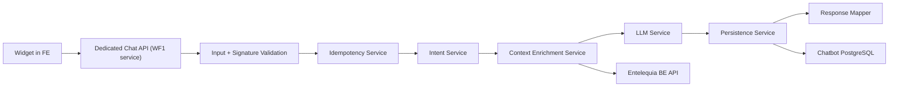

# WF1 Migration Guide: N8N -> Dedicated Backend

Date: 2026-02-09  
Scope: Only WF1 migration (web + whatsapp ingest/orchestration path)  
Status: Implementation guide (production-ready blueprint)

## 1. Purpose

This document defines everything needed to migrate current WF1 behavior from N8N to a dedicated backend service while preserving:

1. Functional parity with current workflow.
2. Existing dedicated chatbot database model.
3. Existing Entelequia backend integrations (products, orders, payment info).
4. Security controls (signature validation, input validation, idempotency, audit).

WF2 and WF3 are explicitly out of scope for now.

## 2. Scope and non-scope

## 2.1 In scope

1. New dedicated backend service for WF1 logic.
2. Endpoint exposed to web widget (`/chatbot/message` style).
3. Business context enrichment by intent.
4. LLM call orchestration.
5. Persistence in dedicated chatbot DB (messages, external_events, audit).
6. Optional outbox enqueue call path (without migrating WF2/WF3 senders yet).

### 2.2 Out of scope

1. WhatsApp sender implementation (WF2).
2. Outbox retry worker implementation (WF3).
3. Full replacement of N8N automations unrelated to WF1.

## 3. Baseline: current WF1 behavior to preserve

Current WF1 functional nodes (from N8N docs):

1. Webhook ingest.
2. Signature validation.
3. Input validation and sanitize.
4. Extract variables.
5. Idempotency check (`external_events`).
6. User context lookup.
7. Conversation history lookup.
8. Intent extraction.
9. Switch by intent for backend calls.
10. Merge context.
11. Output validation.
12. OpenAI chat call.
13. Extract response.
14. Save messages.
15. Audit log.
16. Channel check.
17. Queue whatsapp (when source=whatsapp).
18. HTTP response.

This migration must keep equivalent behavior and output contracts.

## 4. Recommended backend stack

## 4.1 Recommended option (primary)

1. Runtime: Node.js 20 LTS.
2. Language: TypeScript (strict mode).
3. Framework: NestJS (modular architecture, DI, testability).
4. DB: PostgreSQL (reuse existing chatbot schema).
5. ORM/query layer: Prisma or Kysely.
6. Queue adapter (future WF2/WF3): BullMQ + Redis (optional for phase 1).
7. Observability: OpenTelemetry + Sentry (or Datadog).

### 4.2 Why this stack

1. Strong typing for contracts and intent branches.
2. Easy layered architecture (clean architecture + SOLID).
3. Good support for retries, middlewares, guards, interceptors.
4. Fast onboarding for web API teams.

### 4.3 Alternative option

1. Extend existing Laravel backend (`/Users/user/Workspace/p-entelequia24`) with chatbot module.

Use this only if minimizing operational overhead is more important than service decoupling.

## 5. Target architecture (WF1 only)



## 6. Clean architecture boundaries

## 6.1 Domain layer

Core domain objects:

1. `ChatMessage`
2. `Conversation`
3. `Intent`
4. `ContextBlock`
5. `ChatResponse`
6. `ExternalEvent`

Rules:

1. No framework imports.
2. No HTTP or DB code.

### 6.2 Application layer

Use cases:

1. `HandleIncomingMessageUseCase` (WF1 main).
2. `EnrichContextByIntentUseCase`.
3. `PersistConversationUseCase`.
4. `BuildAssistantResponseUseCase`.

Ports:

1. `IntentExtractorPort`
2. `LLMPort`
3. `ContextProviderPort`
4. `ConversationRepositoryPort`
5. `IdempotencyRepositoryPort`
6. `AuditRepositoryPort`

### 6.3 Infrastructure layer

Adapters:

1. HTTP controller adapter.
2. Entelequia backend HTTP adapter.
3. OpenAI adapter.
4. PostgreSQL repositories.
5. Signature validator adapter.

### 6.4 Interface layer

1. REST endpoint for widget.
2. DTO validation.
3. Error mapping and response mapping.

## 7. API contracts

## 7.1 Widget -> Dedicated WF1 API request

```json
{
  "source": "web",
  "userId": "string",
  "conversationId": "string",
  "text": "string",
  "accessToken": "string optional",
  "currency": "ARS optional",
  "locale": "es-AR optional"
}
```

Validation rules:

1. `source` required (`web|whatsapp`).
2. `userId` required, max 255.
3. `conversationId` required, max 255.
4. `text` required, 1..4096 post-sanitize.
5. `accessToken` optional (required for authenticated intents).

### 7.2 Dedicated WF1 API response union

Success:

```json
{
  "ok": true,
  "message": "string",
  "conversationId": "string",
  "intent": "string optional"
}
```

Requires auth:

```json
{
  "ok": false,
  "requiresAuth": true,
  "message": "Para consultar tus ordenes necesitas iniciar sesion."
}
```

Generic failure:

```json
{
  "ok": false,
  "message": "No pudimos procesar tu mensaje."
}
```

## 8. Entelequia backend endpoint mapping (real routes)

Base URL:

1. Prod: `https://entelequia.com.ar/api/v1`
2. Local: `http://127.0.0.1:8000/api/v1`

## 8.1 Product search intent

Primary endpoint:

1. `GET /products-list/{categorySlug?}`

Query:

1. `q`
2. `orderBy=recent`
3. `page=1`
4. `currency=ARS|USD`

Important:

1. Do not call `/api/v1/products` (not a public route).

### 8.2 Product detail intent

1. `GET /product/{idOrSlug}`

### 8.3 Recommendations intent

1. `GET /products/recommended`

### 8.4 Payment/shipping info intent

1. `GET /cart/payment-info` (public)

### 8.5 Order status intent (authenticated)

List:

1. `GET /account/orders`
2. Header: `Authorization: Bearer <accessToken>`
3. Backend requires `auth:api` + `CLIENT` role.

Detail:

1. `GET /account/orders/{id}`
2. Header: `Authorization: Bearer <accessToken>`

Important error semantics:

1. `401`: invalid/expired token.
2. `403`: role mismatch.
3. `442`: order does not belong to client.
4. `404`: order not found.

## 9. Existing chatbot DB reuse strategy

Reuse current schema from:

1. `/Users/user/Workspace/chatbot-EntelequIA/chatbot-widget/sql/01_initial_schema.sql`

WF1 must write to:

1. `users`
2. `conversations`
3. `messages`
4. `external_events`

Optional in phase 1:

1. `outbox_messages` insert when `source=whatsapp`.

### 9.1 Mandatory invariants

1. `external_events (source, external_event_id)` remains unique.
2. `messages(channel, external_event_id)` remains unique when external id exists.
3. All writes done atomically where possible (transaction boundary).

## 10. Security requirements

## 10.1 Input security

1. Validate DTO schema strictly.
2. Sanitize `text`.
3. Reject oversized payloads.

### 10.2 Transport security

1. HTTPS only in production.
2. Restrict CORS to frontend domains.

### 10.3 Signature security

1. Web channel: optional `x-webhook-secret` check.
2. WhatsApp channel: HMAC validation (`x-hub-signature-256`) when applicable.

### 10.4 Secret handling

1. Never use browser-exposed secrets as primary trust anchor.
2. Store API keys server-side only.
3. Do not log full tokens.

## 11. Error handling contract

## 11.1 Error mapping table

1. Validation error -> `400` + safe message.
2. Auth missing for order intent -> `200` with `requiresAuth=true`.
3. Entelequia 401 -> `requiresAuth=true`.
4. Entelequia 403 -> `ok=false` safe permission message.
5. Entelequia 442 -> `ok=false` safe ownership message.
6. Entelequia 404 -> `ok=false` not found message.
7. Entelequia 5xx -> `ok=false` generic fallback.
8. Timeout -> `ok=false` generic fallback.

### 11.2 Logging policy

Structured logs per request:

1. `requestId`
2. `conversationId`
3. `intent`
4. `channel`
5. `backendLatencyMs`
6. `llmLatencyMs`
7. `resultStatus`

Never log:

1. Full `accessToken`
2. Full secret headers
3. Raw PII beyond allowed policy

## 12. Reference implementation structure (NestJS)

```text
src/
  modules/
    wf1/
      wf1.module.ts
      controllers/
        chat.controller.ts
      dto/
        chat-request.dto.ts
        chat-response.dto.ts
      application/
        use-cases/
          handle-incoming-message.use-case.ts
          enrich-context-by-intent.use-case.ts
        ports/
          intent-extractor.port.ts
          llm.port.ts
          entelequia-context.port.ts
          conversation-repository.port.ts
          idempotency-repository.port.ts
          audit-repository.port.ts
      domain/
        entities/
          message.entity.ts
          conversation.entity.ts
      infrastructure/
        adapters/
          openai.adapter.ts
          entelequia-http.adapter.ts
        repositories/
          pg-conversation.repository.ts
          pg-idempotency.repository.ts
          pg-audit.repository.ts
        security/
          signature-validator.ts
          text-sanitizer.ts
```

## 13. WF1 flow pseudocode

```ts
handleIncomingMessage(req):
  validateSignature(req.headers, req.body)
  input = validateAndSanitize(req.body)

  if isDuplicate(input.source, input.externalEventId):
    return buildDuplicateSafeResponse(input)

  user = upsertUser(input.userId)
  conversation = upsertConversation(input.conversationId, user.id, input.source)
  history = getConversationHistory(conversation.id, limit=10)

  intent = extractIntent(input.text, history)
  context = enrichContext(intent, input, history)

  llmOutput = askLLM(input.text, history, context)
  response = mapLLMOutput(llmOutput, intent)

  persistUserMessage(conversation, input)
  persistBotMessage(conversation, response)
  persistAudit(input, intent, response.status)

  if input.source == 'whatsapp':
    enqueueOutbox(response)

  return response
```

## 14. Migration plan (WF1 only)

## 14.1 Phase 0 - Preparation (1-2 days)

1. Freeze WF1 contract and intent matrix.
2. Confirm all endpoint mappings against current backend routes.
3. Define env vars and secrets.
4. Prepare dedicated service repository and CI pipeline.

### 14.2 Phase 1 - Build parity service (3-5 days)

1. Implement ingress controller + validation.
2. Implement idempotency + persistence.
3. Implement intent extraction + context enrichment.
4. Implement OpenAI call + response mapping.
5. Implement audit logging.

### 14.3 Phase 2 - Shadow mode (2-3 days)

1. Keep N8N WF1 as primary responder.
2. Mirror traffic to dedicated WF1 service asynchronously.
3. Compare outputs and latency.
4. Fix parity gaps.

### 14.4 Phase 3 - Controlled cutover (1-2 days)

1. Feature flag route from widget to dedicated WF1 endpoint.
2. Canary rollout:
   - 10%
   - 50%
   - 100%
3. Keep N8N WF1 rollback path available.

### 14.5 Phase 4 - Stabilization (2-3 days)

1. Monitor error rates and intent quality.
2. Tune prompt/context shaping.
3. Document operational runbook.

## 15. Cutover and rollback strategy

## 15.1 Cutover toggles

1. `CHAT_WF1_PROVIDER=n8n|dedicated`
2. `CHAT_WF1_CANARY_PERCENT`
3. `CHAT_WF1_SHADOW_MODE=true|false`

### 15.2 Rollback

Immediate rollback action:

1. Set `CHAT_WF1_PROVIDER=n8n`.
2. Keep dedicated service running in shadow for diagnostics.
3. Preserve request IDs for incident analysis.

## 16. Test plan

## 16.1 Unit tests

1. DTO validation.
2. Intent router.
3. Error mapper.
4. Response mapper.

### 16.2 Integration tests

1. Product search branch with backend mock.
2. Order branch authenticated and unauthenticated.
3. Idempotency duplicate path.
4. Persistence transaction path.

### 16.3 E2E tests

1. Guest product question.
2. Guest order question -> requiresAuth.
3. Logged order question -> valid order response.
4. Logged order not owned -> safe message (442 path).
5. Backend timeout -> safe fallback.

## 17. Operational checklist

Before go-live:

1. Secrets configured in production vault.
2. CORS locked to official domains.
3. Rate limits configured.
4. Health endpoint and alerts configured.
5. Dashboard includes:
   - latency p95
   - error rate
   - requiresAuth ratio
   - backend dependency errors

## 18. Definition of done (WF1 migration)

WF1 migration is complete when:

1. Dedicated backend returns contract-compatible responses for all intents.
2. No regression in guest and authenticated flows.
3. Idempotency and audit are verified in production-like load.
4. 401/403/442 handling is correct and user-safe.
5. Rollback switch to N8N is validated and documented.

## 19. Open decisions to close before implementation

1. Final service location:
   - standalone dedicated service
   - module inside existing Laravel backend
2. Intent extractor model:
   - OpenAI direct classification
   - deterministic rules + LLM fallback
3. Outbox behavior in phase 1:
   - insert only
   - skip enqueue until WF2/WF3 migration
4. Token handling model:
   - temporary browser pass-through
   - immediate backend proxy hardening

## 20. Fast-start backlog (execution order)

1. Create service skeleton + CI.
2. Implement request DTO + validation.
3. Implement idempotency repository.
4. Implement Entelequia backend adapter.
5. Implement intent router and branch handlers.
6. Implement LLM adapter and response mapper.
7. Implement persistence and audit.
8. Implement integration tests.
9. Enable shadow mode.
10. Run canary cutover.

